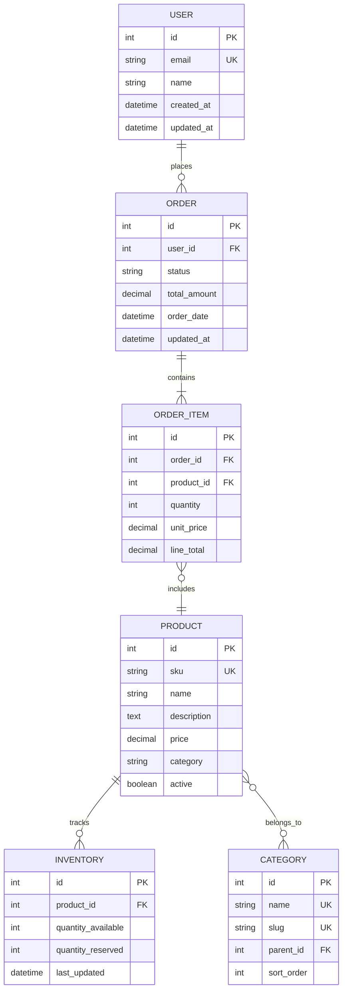

# Entity Relationship Diagram: [SYSTEM_NAME]

## Diagram

## Entity Descriptions

### [ENTITY_NAME]
- **Purpose:** [WHAT_IT_REPRESENTS]
- **Key Fields:**
  - `[FIELD_NAME]`: [DESCRIPTION]
  - `[FIELD_NAME]`: [DESCRIPTION]
- **Relationships:**
  - [RELATIONSHIP_DESCRIPTION]
  - [RELATIONSHIP_DESCRIPTION]
- **Constraints:**
  - [CONSTRAINT_DESCRIPTION]
  - [CONSTRAINT_DESCRIPTION]

## Relationship Rules

### [RELATIONSHIP_NAME]
- **Type:** [ONE_TO_ONE/ONE_TO_MANY/MANY_TO_MANY]
- **Cardinality:** [REQUIRED/OPTIONAL]
- **Cascade:** [CASCADE_RULES]
- **Business Rule:** [BUSINESS_LOGIC]

## Indexes

### [TABLE_NAME]
- Primary Key: `[COLUMN_NAME]`
- Unique: `[COLUMN_NAMES]`
- Index: `[COLUMN_NAMES]` - [PURPOSE]
- Composite: `[COLUMN_1, COLUMN_2]` - [PURPOSE]

## Data Integrity Rules

### [RULE_NAME]
- **Type:** [CHECK/TRIGGER/CONSTRAINT]
- **Implementation:** [HOW_ENFORCED]
- **Validation:** [VALIDATION_LOGIC]

---
*Generated by Bootstrap /design v[VERSION] on [DATE]*