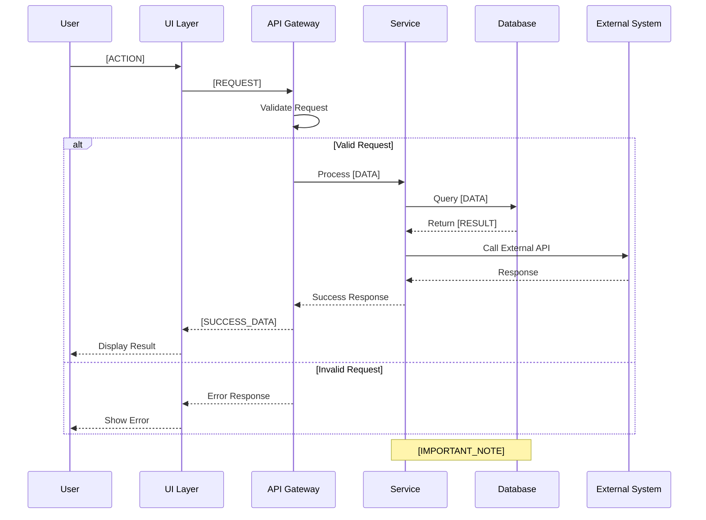

# Sequence Diagram: [INTERACTION_NAME]

## Diagram



## Interaction Flow

### Actor: [ACTOR_NAME]
- **Role:** [ACTOR_ROLE]
- **Responsibilities:** [WHAT_THEY_DO]

### Step-by-Step Flow

1. **[STEP_NAME]**
   - From: [SENDER]
   - To: [RECEIVER]
   - Message: [MESSAGE_DESCRIPTION]
   - Data: `[DATA_FORMAT]`

2. **[STEP_NAME]**
   - From: [SENDER]
   - To: [RECEIVER]
   - Message: [MESSAGE_DESCRIPTION]
   - Data: `[DATA_FORMAT]`

## Message Formats

### Request: [REQUEST_NAME]
```json
{
  "[FIELD]": "[TYPE]",
  "[FIELD]": "[TYPE]"
}
```

### Response: [RESPONSE_NAME]
```json
{
  "[FIELD]": "[TYPE]",
  "[FIELD]": "[TYPE]"
}
```

## Error Scenarios

### [ERROR_SCENARIO]
- **Trigger:** [WHAT_CAUSES_IT]
- **Handling:** [HOW_HANDLED]
- **Recovery:** [RECOVERY_PROCESS]

---
*Generated by Bootstrap /design v[VERSION] on [DATE]*