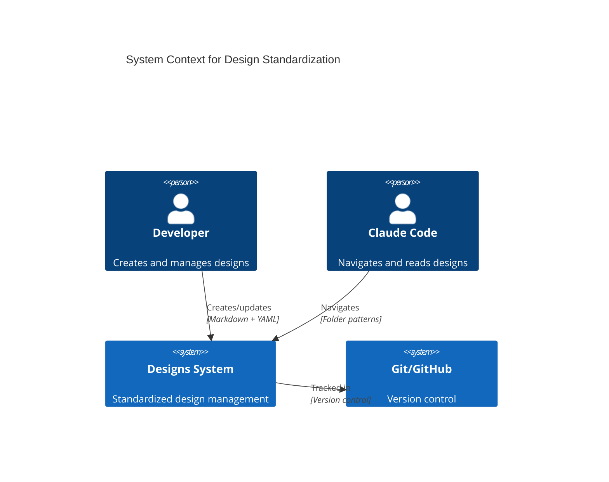
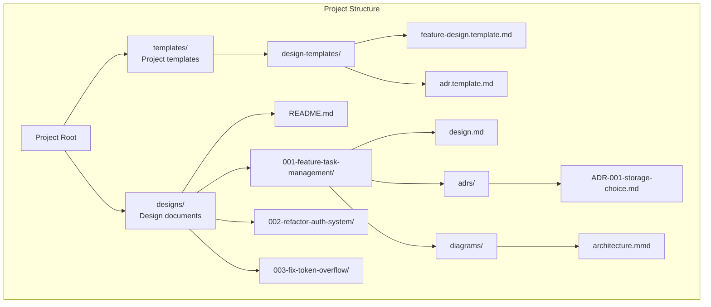

# Standardize Designs Folder Structure Design Document

## Executive Summary

This design document outlines a comprehensive system for standardizing the Bootstrap project's designs folder structure. The solution introduces sequential numbering, metadata-based status tracking, and self-documenting README files in each folder. By establishing clear naming conventions and folder structures, Claude Code can easily navigate and find any design artifact without needing separate index files.

## Requirements

### Functional Requirements
- Implement sequential numbering system (001, 002, etc.) with design type prefixes
- Create metadata-based lifecycle tracking (draft → approved → implementing → completed → archived)
- Establish standard templates for different design types
- Support both simple (single file) and complex (multi-file with ADRs) designs
- Maintain backwards compatibility with existing design references
- Create self-documenting README.md files for folder structure

### Non-Functional Requirements
- **Token Efficiency**: Use YAML frontmatter to minimize storage and token usage
- **Discoverability**: Easy to find designs by number, type, or status via folder structure
- **Simplicity**: No external indexes or complex tooling required
- **Flexibility**: Support various design complexities
- **Version Control**: Git-friendly with clear history tracking
- **Consistency**: Uniform structure across all design artifacts

## Current State Analysis

### Existing Structure
```
designs/
├── analyze-command-design.md
├── analyze-command-adrs/
│   └── ADR-001-modular-analyzer-architecture.md
├── changelog-management-design.md
├── changelog-management-diagrams/
├── claude-memory-integration-design.md
├── claude-memory-integration-adrs/
├── claude-memory-integration-diagrams/
├── git-control-design.md
├── git-control-diagrams/
├── prototypes/
└── standards-documentation-design.md
```

### Issues Identified
1. **Inconsistent naming**: No clear pattern for design folders/files
2. **No status tracking**: Cannot determine if design is draft, approved, or implemented
3. **Poor discoverability**: Hard to find designs without knowing exact names
4. **No documentation**: No README explaining the folder structure
5. **Mixed structures**: Some designs are single files, others have sub-folders

## Proposed Design

### Overview

The standardized structure introduces:

1. **Clear Naming Convention**:
   - **Sequential numbering** with design type prefixes (001-feature-name)
   - **Predictable patterns** that Claude Code can navigate
   - **Self-explanatory names** that indicate purpose

2. **Self-Documenting Structure**:
   - **README.md in each folder** documenting structure and conventions
   - **YAML frontmatter** for metadata and status tracking
   - **Consistent folder organization** for all design complexities
   - **Standard templates** to ensure uniformity

### Architecture

#### System Context


#### Component Structure


### Design Details

#### Folder Documentation Pattern

Each root-level folder must contain a README.md that serves as the canonical documentation for that folder's structure and conventions. This creates a self-documenting file system.

**README.md Structure**:
```markdown
# [Folder Name] Structure

## Purpose
Brief description of what this folder contains

## Structure
```
folder/
├── required-file.ext    # Description (REQUIRED)
├── optional-file.ext    # Description (OPTIONAL)
└── subfolder/          # Description
```

## Naming Conventions
- Pattern: `naming-pattern-here`
- Examples: ...

## Required Contents
- What must be in every item

## ⚠️ UNDEFINED STRUCTURE WARNING ⚠️
**This section needs definition. Please update during implementation.**
```

#### Template Organization
Project-specific templates are stored in `templates/` at the project root:
- `templates/design-templates/` - Design document templates
- `templates/prp-templates/` - PRP templates (existing)
- Other template categories as needed

**Note**: System templates in `.claude/templates/` are for Claude's internal use and should NOT be modified. Similarly, `temp/` directories should be left untouched.

#### 1. Naming Convention
Pattern: `{sequence}-{type}-{description}/`
- **Sequence**: Three-digit zero-padded number (001, 002, etc.)
- **Type**: One of [feature, refactor, fix, spike, system]
- **Description**: Kebab-case meaningful name

Examples:
- `001-feature-task-management/`
- `002-refactor-auth-system/`
- `003-fix-token-overflow/`
- `004-spike-performance-testing/`
- `005-system-database-migration/`

#### 2. Folder Structure
Each design follows this structure:
```
{sequence}-{type}-{description}/
├── design.md           # Main design document with YAML frontmatter
├── adrs/              # Architecture Decision Records (if needed)
│   ├── ADR-001-{decision}.md
│   └── ADR-002-{decision}.md
└── diagrams/          # Mermaid diagrams (if needed)
    ├── context.mmd
    └── components.mmd
```

#### 3. YAML Frontmatter
All design.md files include:
```yaml
---
title: Human-readable title
status: draft|approved|implementing|completed|archived
created: YYYY-MM-DD
updated: YYYY-MM-DD
type: feature|refactor|fix|spike|system
author: Name or identifier
tags: [tag1, tag2]
estimated_effort: small|medium|large
actual_effort: small|medium|large  # Added after completion
---
```

#### 4. Status Lifecycle
- **draft**: Initial creation, work in progress
- **approved**: Reviewed and ready for implementation
- **implementing**: Currently being built
- **completed**: Implementation finished
- **archived**: No longer relevant but kept for history

#### 5. Design Discovery

With clear naming conventions and folder structures, Claude Code can find any design by:
- Listing folders with pattern `[0-9]{3}-{type}-*`
- Reading frontmatter for status and metadata
- Following documented structure in README.md
- No index files or special commands needed!

### Implementation Approach

**Design Principle**: Commands should be generalized and reusable. Single-purpose commands should only exist when there's a compelling technical reason. This approach:
- Reduces command proliferation
- Makes the system more learnable
- Enables consistent patterns across artifact types
- Simplifies maintenance

#### Phase 1: Structure Definition
1. Create template files in `templates/design-templates/`
2. Document naming conventions
3. Define YAML frontmatter schema
4. IMPORTANT: Do NOT modify templates in `.claude/` or `temp/` directories

#### Phase 2: CLI Tool Development
1. Implement generalized `/index` command
2. Implement generalized `/validate` command  
3. Implement generalized `/new` command

#### Phase 3: Migration
1. Manually migrate existing designs to new structure
2. Update all internal references
3. Generate initial index

#### Phase 4: Integration
1. Update CLAUDE.md with design conventions
2. Add design status to TASK.md workflow
3. Create Git hooks for validation (optional)

## Alternative Approaches Considered

### 1. Folder-based Status Tracking
**Approach**: Use folders like draft/, approved/, etc.
**Pros**: Visual organization, clear at a glance
**Cons**: Breaks Git history on moves, complex references
**Decision**: Rejected in favor of metadata approach

### 2. Date-based Numbering
**Approach**: Use YYYY-MM-DD instead of sequential numbers
**Pros**: Natural chronological ordering
**Cons**: Harder to reference, longer paths
**Decision**: Rejected for simplicity


## Risks and Mitigations

### Technical Risks
1. **Risk**: Developers don't follow naming conventions
   - **Mitigation**: Clear documentation in README, examples

2. **Risk**: Broken references to renamed designs
   - **Mitigation**: Maintain redirect mapping during migration

### Process Risks
1. **Risk**: Developers forget to update status
   - **Mitigation**: Include in PR checklist

2. **Risk**: Inconsistent frontmatter
   - **Mitigation**: Templates and clear examples

## Success Criteria

- [ ] All designs follow standardized structure
- [ ] Claude Code can find any design using folder patterns
- [ ] Zero broken references after migration
- [ ] 90% reduction in time to find designs
- [ ] Status tracking adopted by all contributors
- [ ] Templates used for all new designs
- [ ] Every root folder has a README.md documenting its structure
- [ ] No "undefined structure" warnings remain

## Future Extensibility

The standardized naming and README documentation pattern:
- Can be applied to other folders (features, PRPs, tests)
- Works with Claude Code's file system navigation
- Provides clear structure without external dependencies
- Makes the entire project self-documenting

This design focuses on the designs folder while establishing patterns that benefit the entire project.

## Next Steps

1. Create design template files
2. Write comprehensive README.md files
3. Migrate existing designs
4. Update documentation

## Implementation Tasks

### Phase 1: Templates and Documentation
- [ ] Create `templates/design-templates/` directory at project root
- [ ] Create all design templates (feature, refactor, fix, spike, system)
- [ ] Create ADR template
- [ ] Create/update README.md in each root folder with:
  - Folder purpose and structure
  - Naming conventions
  - Required vs optional contents
  - Warning sections for undefined structures
- [ ] Add design lifecycle documentation to designs/README.md
- [ ] IMPORTANT: Leave `.claude/templates/` and `temp/` directories untouched

### Phase 2: Structure Implementation
- [ ] Ensure all designs have valid YAML frontmatter
- [ ] Verify folder naming follows conventions
- [ ] Create clear examples in README.md

### Phase 3: Migration
- [ ] Determine chronological order of existing designs
- [ ] Assign sequential numbers based on creation date
- [ ] Rename designs to follow new naming convention
- [ ] Move single-file designs into proper folder structure
- [ ] Ensure all designs have proper frontmatter
- [ ] Update all internal references

### Phase 4: Integration
- [ ] Update CLAUDE.md with design conventions
- [ ] Add design rules to .claude/rules/project/
- [ ] Update TASK.md workflow to include design status
- [ ] Create README.md files for all root folders:
  - features/README.md
  - PRPs/README.md
  - tests/README.md
  - docs/README.md
  - .claude/README.md
  - templates/README.md
- [ ] Add warning sections for any undefined structures

## Questions for Implementation

When implementing, developers should:
1. Ask about preferred YAML parsing library
2. Confirm CLI command implementation approach
3. Verify migration sequence for existing designs
4. Check if Git hooks should be mandatory or optional