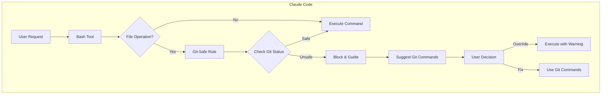

# Git-Safe File Operations Design Document

## Executive Summary

This design introduces a comprehensive safety system for file operations within git repositories. The system prevents accidental data loss by enforcing git-aware checks before any potentially destructive file operations. This feature was identified as critical after discovering that current implementations use direct file operations without verifying git status, potentially leading to loss of uncommitted changes.

## Requirements

### Functional Requirements

1. **Safe Operation Enforcement**
   - Default to git-safe operations for all destructive commands (rm, rmdir, mv)
   - Check git status before operations to detect uncommitted changes
   - Check for untracked files that would be lost
   - Provide clear error messages when operations are blocked

2. **Override Mechanism**
   - Allow advanced users to disable the rule globally
   - Support per-operation overrides with explicit flags
   - Never automatically fall back to unsafe operations
   - Require explicit user action for overrides

3. **Git Command Integration**
   - Use `git rm` instead of `rm` for tracked files
   - Use `git mv` instead of `mv` for tracked files
   - Preserve git history through proper commands
   - Handle git command failures gracefully

4. **User Feedback**
   - Provide clear explanations when operations fail
   - Suggest appropriate git commands to resolve issues
   - Show what would be lost if operation proceeded
   - Guide users to safe alternatives

### Non-Functional Requirements

- **Performance**: Minimal overhead (<100ms for status checks on typical operations)
- **Security**: Medium security level to allow overrides when necessary
- **Compatibility**: Work with all git versions 2.0+
- **Usability**: Clear, actionable error messages that don't interrupt workflow
- **Reliability**: Handle edge cases (no git repo, corrupted git state, etc.)

## Current State Analysis

### Existing Patterns

1. **Git Rules Structure**
   - Rules in `.claude/rules/git/` with YAML configuration
   - Separate documentation in `.claude/.claude/docs/rules/git/`
   - User preferences in `.claude/rules/config/user-preferences.yaml`
   - Template support for common patterns

2. **Current File Operations**
   - PRPs use direct commands: `rm -rf`, `rmdir`, `mv`
   - No git status checks before destructive operations
   - No warnings about uncommitted changes
   - Risk of data loss in migrations and refactoring

3. **Integration Points**
   - Bash tool is primary interface for file operations
   - Git rules already hook into git commands
   - Existing pattern for rule triggers and conditions

## Proposed Design

### Overview

Implement a git-safe file operations rule that intercepts destructive file commands and enforces safety checks. The rule will:
1. Detect when destructive file operations are attempted
2. Check git status for the affected paths
3. Block operations that would lose data
4. Provide clear guidance on safe alternatives
5. Allow explicit overrides when needed

### Architecture



### Component Design

#### 1. Rule Definition (`.claude/rules/git/git-safe-file-operations.md`)

```yaml
trigger: "file operations"
conditions:
  - command_matches: ["rm", "rmdir", "mv"]
  - not_in_override_mode: true
actions:
  - check_git_status: true
  - block_if_uncommitted: true
  - suggest_git_alternative: true
validations:
  - path_exists: true
  - in_git_repo: true
  - no_uncommitted_changes: true
  - no_untracked_files: true
error_handling:
  - show_affected_files: true
  - provide_safe_alternative: true
  - no_automatic_fallback: true
```

#### 2. Safety Check Logic

```python
def check_file_operation_safety(command, paths):
    """Check if file operation is safe to perform"""
    
    # Parse the operation type
    operation = parse_operation(command)  # rm, rmdir, mv, etc.
    
    # Check if we're in a git repository
    if not in_git_repository():
        return SafetyResult(safe=True, reason="Not in git repository")
    
    # Check git status for affected paths
    for path in paths:
        status = git_status_for_path(path)
        
        # Check for uncommitted changes
        if status.has_uncommitted_changes:
            return SafetyResult(
                safe=False,
                reason=f"Uncommitted changes in {path}",
                suggestion=f"Commit or stash changes first: git add {path} && git commit"
            )
        
        # Check for untracked files
        if operation in ['rm', 'rmdir'] and status.has_untracked_files:
            return SafetyResult(
                safe=False,
                reason=f"Untracked files in {path} would be lost",
                suggestion=f"Review files with: git status {path}"
            )
    
    # Suggest git alternatives for tracked files
    if operation == 'rm' and is_tracked(path):
        return SafetyResult(
            safe=True,
            warning=f"Consider using: git rm {path}",
            preserve_history=True
        )
    
    return SafetyResult(safe=True)
```

#### 3. Error Messages and Guidance

```bash
# Example error output
ERROR: Cannot remove 'src/utils/': uncommitted changes detected

Affected files:
  M src/utils/helpers.py
  ? src/utils/new_module.py

To proceed safely:
  1. Commit changes: git add src/utils/ && git commit -m "Save work"
  2. Or stash changes: git stash push -m "Temporary" src/utils/
  3. Or force removal (DANGEROUS): rm -rf src/utils/ --force-unsafe

NOTE: Using --force-unsafe may result in permanent data loss
```

### Design Decisions

1. **Default Safety**: All operations are safe by default, requiring explicit override
2. **No Automatic Fallback**: If git commands fail, stop and ask for guidance
3. **Path-Specific Checks**: Only check git status for affected paths (performance)
4. **Clear Messaging**: Every block includes why and how to proceed
5. **Git Command Preference**: Always suggest git equivalents when available

## Alternative Approaches Considered

### Option 1: Automatic Stashing
**Approach**: Automatically stash changes before operations
**Pros**: Seamless user experience, no data loss
**Cons**: Hidden behavior, stash conflicts, user confusion
**Decision**: Rejected - too much hidden magic

### Option 2: Confirmation Prompts
**Approach**: Ask for confirmation on every destructive operation
**Pros**: User awareness, explicit consent
**Cons**: Workflow interruption, prompt fatigue
**Decision**: Rejected - too disruptive

### Option 3: Git-Only Operations (Chosen)
**Approach**: Block unsafe operations, require git commands or explicit override
**Pros**: Safe by default, preserves history, educational
**Cons**: Slight learning curve for new users
**Decision**: Selected - best balance of safety and usability

## Implementation Plan

1. Create rule definition file with YAML configuration
2. Implement safety check logic in rule
3. Create comprehensive documentation
4. Add user preference options
5. Update existing PRPs to use safe patterns
6. Add integration tests
7. Create migration guide for existing projects

## Risks and Mitigations

| Risk | Impact | Likelihood | Mitigation |
|------|--------|------------|------------|
| Performance impact on large repos | Medium | Medium | Path-specific git status checks |
| User frustration with blocks | High | Low | Clear messages and easy overrides |
| Git command failures | Medium | Low | Graceful degradation with guidance |
| Breaking existing workflows | High | Medium | Gradual rollout with clear docs |

## Success Criteria

- [ ] Zero accidental data loss from file operations
- [ ] <100ms overhead for typical operations
- [ ] 90% of operations use git-safe commands
- [ ] Clear error messages guide users to resolution
- [ ] Advanced users can override when needed
- [ ] All new PRPs use safe file operations

## References

- Git documentation: https://git-scm.com/docs/git-rm
- Similar tools: git-safe, git-extras
- Original issue: Discovered during diagram migration PRP execution

## Validation Checklist

- [x] All requirements clearly documented
- [x] Multiple design alternatives considered (3 options)
- [x] Trade-offs explicitly documented
- [x] Key architectural decisions have ADRs (3 created)
- [x] Integration points identified (Bash tool, git rules)
- [x] Risks assessed with mitigations
- [x] Diagrams show system structure clearly
- [x] Design aligns with existing patterns
- [x] Implementation tasks identified
- [x] Design ready for PRP generation

## Next Steps

1. Review design with stakeholders
2. Generate PRP using this design document
3. Implement git-safe file operations rule
4. Update existing PRPs to use safe patterns
5. Create migration guide for existing projects
6. Monitor adoption and gather feedback