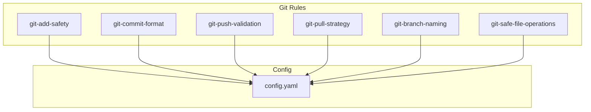

# Git Rules Alignment Design Document

---
title: Git Rules Alignment with Standardization Design
status: approved
created: 2025-08-10
updated: 2025-08-10
type: refactor
author: Claude
tags: [rules, git, standardization, refactoring]
estimated_effort: 4-6 hours
---

## Executive Summary

This design document outlines the refactoring of existing Git rules to align with the standardization patterns established in the CLAUDE.md Standardization project (Phases 1-4). The Git rules predate these patterns and require updates to metadata format, configuration extraction, and documentation structure to ensure consistency across the rule system.

## Requirements

### Functional Requirements
1. **Metadata Enhancement**: Add Priority and Dependencies fields to all Git rules
2. **Configuration Extraction**: Move hardcoded values to centralized config.yaml with proper reference mechanism
3. **Format Standardization**: Align YAML structure with newer rule patterns
4. **Documentation Enhancement**: Expand documentation to comprehensive format
5. **Issue Resolution**: Fix known issues and add new capabilities where possible
6. **Test Compatibility**: Update tests to match new format and behaviors

### Non-Functional Requirements
1. **Token Efficiency**: Reduce rule size by 20-30% through config extraction
2. **Maintainability**: Single source of truth for Git configuration values
3. **Enhanced Functionality**: Improve rules based on lessons learned
4. **Consistency**: Uniform structure across all 20+ rules in the system
5. **Reference Mechanism**: Simple, standard config reference syntax

## Current State Analysis

### Existing Git Rules Structure
The current Git rules have:
- **Incomplete Metadata**: Missing Priority and Dependencies fields
- **Hardcoded Values**: Configuration embedded directly in rules
- **Inconsistent Format**: Varying structure across different rules
- **Documentation Links**: Some rules missing proper documentation references

### Pattern Differences
| Aspect | Current Git Rules | Standardized Pattern |
|--------|------------------|---------------------|
| Metadata Fields | 4 fields | 6 fields (+ Priority, Dependencies) |
| Config Values | Hardcoded | Referenced from config.yaml |
| Documentation | Mixed approach | Consistent brief + link pattern |
| Token Impact | ~40-80 tokens | Target: ~30-50 tokens |

### Integration Points
- `.claude/MASTER_IMPORTS.md`: Already imports all Git rules
- `.claude/config.yaml`: Needs new `git:` section
- `.claude/.claude/docs/rules/git/`: Documentation exists but needs format updates
- `tests/test_git_rules.py`: Tests need updating for new format

## Proposed Design

### Overview
Implement a systematic refactoring of all 6 Git rules to align with standardization patterns. This includes developing a config reference mechanism, updating metadata format, and creating comprehensive documentation while maintaining current behavior (issues to be addressed in future work).

### Architecture

#### Config Reference Mechanism

The reference mechanism allows rules to reference values from config.yaml while maintaining defaults within the rules themselves for reliability:

**Syntax Pattern**: `{{config.path.to.value:default_value}}`

**Examples**:
- `{{config.git.max_file_size:10MB}}` → Uses config value or "10MB" default
- `{{config.git.protected_branches:[main,master,develop]}}` → Uses config or default array
- `{{config.git.commit_format:conventional}}` → Uses config or "conventional" default

**Implementation Approach**:
1. **Parse Phase**: Rules contain references with inline defaults
2. **Resolution Phase**: Try to resolve from config.yaml
3. **Fallback Phase**: Use inline default if config missing or error

**Reference Resolution Rules**:
- Path uses dot notation for nested values
- Colon separates path from default value
- Default is used if config.yaml missing or path not found
- Arrays use comma-separated values in defaults
- No external file dependency for basic operation

**Example in Rule**:
```yaml
validations:
  - max_file_size: "{{config.git.max_file_size:10MB}}"
  - forbidden_patterns: "{{config.git.forbidden_patterns:[*.env,*.key,*.pem]}}"
  - timeout: 30  # Static value, no config option
```

**Benefits of Inline Defaults**:
- Rules work without config.yaml
- Reduced file loading overhead
- Clear documentation of defaults
- Config becomes purely for customization
- Better error resilience

#### Configuration Structure
```yaml
# Addition to .claude/config.yaml
git:
  # Safety settings
  max_file_size: "10MB"
  forbidden_patterns:
    - "*.env"
    - "*.key"
    - "*.pem"
    - "*_secret*"
    - "*password*"
  
  # Branch management
  default_branch: "main"
  protected_branches: ["main", "master", "develop", "release/*"]
  branch_pattern: "^(feature|fix|docs|refactor|test|chore)/.+-[a-f0-9]{7}$"
  
  # Commit settings
  commit_format: "conventional"
  subject_max_length: 250
  body_line_length: 72
  allowed_types: ["feat", "fix", "docs", "style", "refactor", "test", "chore", "perf", "ci", "build"]
  
  # Pull/Push strategies
  prefer_rebase: true
  force_push_protection: true
  require_upstream_check: true
  default_pull_strategy: "--rebase"
  
  # File operations
  require_git_check: true
  block_if_uncommitted: true
```

#### Rule Structure Pattern
```yaml
# Standardized rule structure with inline defaults
### Rule Metadata
- ID: git/{rule-name}
- Status: Active
- Security Level: {High|Medium|Low}
- Token Impact: ~{XX} tokens per operation
- Priority: {100-800}
- Dependencies: [{rule-dependencies}]

### Rule Configuration
trigger: {when-to-apply}
conditions:
  - {activation-conditions}
actions:
  - {what-to-do}
  - {use-config-with-defaults}
validations:
  - {what-to-check}
  - max_file_size: "{{config.git.max_file_size:10MB}}"
  - forbidden_patterns: "{{config.git.forbidden_patterns:[*.env,*.key]}}"

### Behavior
- {Clear description of what the rule does}
- {When it triggers}
- {What it prevents or enforces}
- {Default values and why}

---

📚 **Full Documentation**: [.claude/.claude/docs/rules/git/{rule-name}.md](../../../.claude/.claude/docs/rules/git/{rule-name}.md)
```

#### Comprehensive Documentation Format
Each Git rule will have expanded documentation in `.claude/.claude/docs/rules/git/` following this structure:

```markdown
# Git Rule: {Rule Name}

## Overview
Brief description of the rule's purpose and importance.

## Trigger Conditions
- When this rule activates
- Specific Git commands monitored
- Context requirements

## Actions
### What the Rule Does
- Step-by-step behavior
- Checks performed
- Validations applied

### Configuration Options
| Setting | Default | Config Path | Description |
|---------|---------|-------------|-------------|
| max_file_size | 10MB | git.max_file_size | Maximum file size allowed |
| protected_branches | [main,master] | git.protected_branches | Branches with protection |

## Examples
### Good Practices
```bash
# Example of correct usage
git add specific-file.js
```

### Prevented Patterns
```bash
# What this rule prevents
git add .  # Blocked by rule
```

## Troubleshooting
### Common Issues
- Issue: "File too large" error
  - Solution: Check file size, consider .gitignore

### Override Options
- Temporary disable: `--no-verify` flag
- Config override: Set in config.yaml

## Security Considerations
- Why this rule exists
- Risks it mitigates
- Best practices

## Related Rules
- Links to related Git rules
- Workflow connections
```

### Design Decisions

#### Priority Assignment Matrix
| Security Level | Priority Range | Rationale |
|---------------|---------------|-----------|
| High | 700-800 | Critical safety rules (add, push) |
| Medium | 400-600 | Important workflow rules (pull, commit) |
| Low | 100-300 | Convention rules (branch naming) |

#### Specific Priority Assignments
- `git-add-safety`: 750 (High security, prevents secrets)
- `git-push-validation`: 700 (High security, protects branches)
- `git-safe-file-operations`: 650 (Medium-High, prevents data loss)
- `git-pull-strategy`: 500 (Medium, workflow safety)
- `git-commit-format`: 400 (Medium, consistency)
- `git-branch-naming`: 300 (Low, convention)

### Implementation Components

#### Phase 1: Configuration Setup
1. Add `git:` section to config.yaml
2. Define all extracted values
3. Set up override capability
4. Validate YAML structure

#### Phase 2: Rule Refactoring
For each rule:
1. Add Priority field based on security level
2. Add Dependencies field (most will be empty `[]`)
3. Replace hardcoded values with config references
4. Ensure consistent YAML structure
5. Update documentation link format

#### Phase 3: Documentation Updates
1. Streamline existing documentation
2. Ensure consistent format across all Git rule docs
3. Add missing documentation links
4. Update README.md in .claude/.claude/docs/rules/git/

#### Phase 4: Test Updates
1. Update test expectations for new metadata format
2. Add validation for config references
3. Ensure backward compatibility tests
4. Verify token reduction achieved

## Alternative Approaches Considered

### Alternative 1: External Config Defaults
**Approach**: Store all defaults in config.yaml, rules only have references

**Pros**:
- Single source for all defaults
- Smaller rule files

**Cons**:
- Rules don't work without config.yaml
- More file dependencies
- Harder to understand rule behavior

### Alternative 2: No Config References
**Approach**: Keep all values hardcoded in rules

**Pros**:
- Simplest implementation
- No reference mechanism needed
- Rules completely self-contained

**Cons**:
- No customization without editing rules
- Redundant values across rules
- Harder to maintain consistency

### Alternative 3: Inline Defaults with Config Override (Chosen)
**Approach**: Rules contain defaults inline with config reference syntax

**Pros**:
- Rules work standalone
- Config provides customization
- Clear default documentation
- Reduced file dependencies
- Better error resilience

**Cons**:
- Slightly larger rule files
- Need to implement reference parser

## Implementation Plan

### Task Breakdown
1. **Audit Phase** (30 min)
   - Document all hardcoded values per rule
   - Identify common configuration patterns
   - Note specific metadata gaps

2. **Config Update** (30 min)
   - Add git section to config.yaml
   - Define all extracted values
   - Test YAML validity

3. **Rule Updates** (3 hours)
   - Update each rule (~30 min per rule)
   - Add metadata fields
   - Replace hardcoded values
   - Test individually

4. **Documentation** (1 hour)
   - Update documentation format
   - Add missing links
   - Update README

5. **Testing** (1 hour)
   - Update test expectations
   - Run full test suite
   - Verify token reduction

### Migration Order
1. `git-branch-naming` (simplest, low risk)
2. `git-commit-format` (clear patterns)
3. `git-pull-strategy` (medium complexity)
4. `git-add-safety` (high impact)
5. `git-push-validation` (high impact)
6. `git-safe-file-operations` (most complex)

## Risks and Mitigations

### Technical Risks

| Risk | Impact | Likelihood | Mitigation |
|------|--------|------------|------------|
| Config reference system doesn't exist | High | Medium | Implement simple string replacement initially |
| Breaking existing workflows | High | Low | Maintain exact behavior, extensive testing |
| Token reduction not achieved | Low | Low | Measure before/after, iterate if needed |
| Test failures from format changes | Medium | High | Update tests in parallel with changes |

### Project Risks

| Risk | Impact | Likelihood | Mitigation |
|------|--------|------------|------------|
| Scope creep (fixing behaviors) | Medium | Medium | Strict focus on refactoring only |
| Documentation inconsistency | Low | Medium | Use templates from newer rules |
| Integration issues | Medium | Low | Test with full rule set loaded |

## Success Criteria

### Quantitative Metrics
- [ ] All 6 Git rules updated with enhanced metadata
- [ ] 20-30% reduction in average rule token size
- [ ] 100% of Git rule tests passing
- [ ] 0 behavior changes (pure refactoring)

### Qualitative Metrics
- [ ] Consistent structure across all rules
- [ ] Clear configuration separation
- [ ] Improved maintainability
- [ ] Better documentation alignment

### Validation Steps
1. **Unit Testing**: Each rule passes individual tests
2. **Integration Testing**: All rules work together
3. **Token Measurement**: Verify size reduction
4. **Manual Testing**: Test actual Git operations
5. **Documentation Review**: Ensure completeness

## Architecture Decision Records

The following ADRs document key design decisions for this refactoring:

- **[ADR-001: Config Reference Mechanism](adrs/ADR-001-config-reference-mechanism.md)** - Inline defaults with config override pattern
- **[ADR-002: Priority Assignment Strategy](adrs/ADR-002-priority-assignment-strategy.md)** - Security-based priority assignment
- **[ADR-003: Documentation Format](adrs/ADR-003-comprehensive-documentation-format.md)** - Comprehensive documentation structure

## Architecture Diagrams

### System Overview
- **[System Context](diagrams/system-context.mmd)** - How Git rules interact with Claude environment and Git operations
- **[Config Resolution Flow](diagrams/config-resolution-flow.mmd)** - Sequence of config reference resolution with fallback to defaults
- **[Rule Processing Pipeline](diagrams/rule-processing-pipeline.mmd)** - Three-phase rule processing from loading to execution

## Appendix

### Sample Refactored Rule

Before (current git-add-safety.md):
```yaml
### Rule Metadata
- ID: git/git-add-safety
- Status: Active
- Security Level: High
- Token Impact: ~50 tokens per git add operation

### Rule Configuration
validations:
  - max_file_size: 10MB
  - warn_on_binary: true
```

After (refactored with inline defaults):
```yaml
### Rule Metadata
- ID: git/git-add-safety
- Status: Active
- Security Level: High
- Token Impact: ~35 tokens per operation
- Priority: 750
- Dependencies: []

### Rule Configuration
validations:
  - max_file_size: "{{config.git.max_file_size:10MB}}"
  - warn_on_binary: "{{config.git.warn_on_binary:true}}"
  - forbidden_patterns: "{{config.git.forbidden_patterns:[*.env,*.key,*.pem]}}"

### Behavior
- Prevents accidental staging of sensitive files
- Checks file size before staging (default: 10MB max)
- Warns when binary files are staged
- Blocks common secret file patterns

---

📚 **Full Documentation**: [.claude/.claude/docs/rules/git/git-add-safety.md](../../../.claude/.claude/docs/rules/git/git-add-safety.md)
```

### Measurement Methodology

Token count comparison:
1. Count tokens in current rule files
2. Count tokens after refactoring
3. Calculate percentage reduction
4. Target: 20-30% reduction average

### Dependencies Graph

