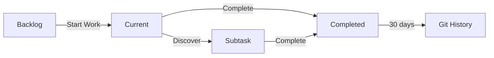

# Enhanced Task Structure Design Document

## Executive Summary
Transform the current unstructured TASK.md into a robust, compact task management system with metadata, commands, and automated cleanup. The design maintains simplicity while adding structure needed for scaling, using git commits as the permanent task archive.

## Requirements

### Functional Requirements
- Structure TASK.md with clear sections (Current, Backlog, Completed)
- Add metadata (ID, priority, dates, estimates) using HTML comments
- Implement task management commands for CRUD operations
- Audit and consolidate existing 219 lines of tasks
- Use git commits as permanent task archive
- Support both user and Claude agent task management

### Non-Functional Requirements
- Keep TASK.md compact and readable
- Maintain token efficiency (15% advantage over JSON)
- Quick to implement for Bootstrap v1.0 readiness
- No external dependencies
- Support incremental, task-focused commits

## Current State Analysis

### Problems in Current TASK.md
1. **Duplication**: Two "Discovered During Work" sections
2. **No Structure**: 200+ lines of mixed priorities
3. **No Metadata**: Can't track creation, completion, estimates
4. **Manual Management**: No automation for cleanup
5. **Context Bloat**: Unaudited tasks affecting context window

### Existing Patterns
- Commands in `.claude/commands/` follow standard structure
- Rules in `.claude/rules/project/` manage project artifacts
- CHANGELOG.md provides high-level release history
- Git commits provide detailed change history

## Proposed Design

### Overview
Implement a structured single-file task management system with visible metadata in plain markdown, supported by task commands for automation. Use git commits with task IDs as the permanent archive, keeping TASK.md focused on active work.

### Architecture

#### Task Structure
```markdown
# Task Management
**Version:** 2.0  
**Last Audit:** 2025-08-28

## Current Tasks
*Active work for next commit/release*

### [HIGH] TASK-001: Enhanced Task Structure
**Created:** 2025-08-28  
**Estimate:** 2d  
**Status:** in-progress
- [x] Design new structure
- [ ] Implement commands
- [ ] Migrate existing tasks
**Discovered:** 2025-08-28
- [ ] Add validation rules

## Backlog
*Future work, organized by priority*

### [MEDIUM] TASK-002: SDLC Consolidation  
**Created:** 2025-08-28  
**Blocked by:** TASK-001
- [ ] Design directory structure
- [ ] Migrate files

### [LOW] TASK-003: Documentation Enhancements
**Created:** 2025-08-20
- [ ] Create how-to guides
- [ ] Add reference docs

## Completed
*Recent completions, auto-removed after 30 days*

### ✓ TASK-000: Framework Documentation Separation
**Completed:** 2025-08-28
- [x] Move docs to .claude/docs/
- [x] Update references
```

#### Task Commands

**`/task-add`** - Add new task with metadata
```markdown
Usage: /task-add [priority] "title" [estimate]
Example: /task-add high "Fix git rules" 2d

Adds task with auto-generated ID to appropriate section
```

**`/task-update`** - Update task status or metadata
```markdown
Usage: /task-update TASK-001 status=done
       /task-update TASK-002 priority=high

Modifies task metadata and moves between sections
```

**`/task-audit`** - Clean up, migrate, and reorganize TASK.md
```markdown
Usage: /task-audit [--migrate]

Standard audit:
- Removes completed tasks older than 30 days
- Identifies duplicate tasks
- Suggests consolidations
- Reorders by priority

With --migrate flag (or when detecting old format):
- Converts unstructured tasks to new format
- Generates task IDs for existing tasks
- Adds metadata (estimates user confirmation)
- Presents removal candidates for approval
- Reorganizes into Current/Backlog/Completed sections
```

**`/task-summary`** - Generate task summary
```markdown
Usage: /task-summary [filter]

Outputs:
- Current: 3 tasks (1 high, 2 medium)
- Backlog: 45 tasks
- Completed this week: 5 tasks
```

#### Task Lifecycle


### Design Decisions

1. **Single File Architecture** (ADR-001)
   - Keep TASK.md as single file
   - Use sections for organization
   - Commands handle complexity

2. **Task-Focused Commits** (ADR-002)
   - One task per commit when feasible
   - Task IDs in commit messages
   - Git history as permanent archive

3. **Metadata in Plain Markdown**
   - Visible in rendered output
   - Same token efficiency as HTML comments
   - Better transparency for users

## Alternative Approaches Considered

### Alternative 1: Minimal Enhancement
- Just add priority tags
- **Rejected**: Doesn't solve core problems

### Alternative 2: Structured Single File ✓ SELECTED
- Metadata, commands, automation
- **Selected**: Best balance of simplicity and functionality

### Alternative 3: Multi-File System
- Separate CURRENT.md, BACKLOG.md
- **Rejected**: Adds complexity without sufficient benefit

## Implementation Plan

### Phase 1: Foundation (Day 1)
1. Create templates:
   - `.claude/templates/task.template.md`
   - `.claude/templates/task-commit.template`
   - `.claude/templates/task-discovered.template.md`
2. Create/update rules:
   - `.claude/rules/project/task-management.md`
   - `.claude/rules/project/task-discovery.md`
   - `.claude/rules/git/task-commit-integration.md`
   - Update `.claude/rules/git/git-commit-format.md`
3. Implement `/task-audit` command with migration capability

### Phase 2: Migration & Commands (Day 2)
1. Run `/task-audit --migrate` to convert existing TASK.md:
   - Backup current TASK.md
   - Present removal candidates for approval
   - Auto-generate task IDs
   - Apply new structure with metadata
2. Implement remaining commands:
   - `/task-add` command
   - `/task-update` command
   - `/task-summary` command
3. Test migration results

### Phase 3: Integration & Testing (Day 3)
1. Test all commands with migrated TASK.md
2. Verify git commit integration
3. Test task discovery workflow
4. Document new workflow
5. Final validation and cleanup

## Risks and Mitigations

### Risk: Large Migration Complexity
- **Mitigation**: Present candidates for removal to user for approval
- **Mitigation**: Migrate in sections with validation

### Risk: Command Implementation Time
- **Mitigation**: Start with basic commands, enhance later
- **Mitigation**: Reuse patterns from existing commands

### Risk: User Workflow Disruption
- **Mitigation**: Commands are optional initially
- **Mitigation**: Maintain backward compatibility during migration

## Success Criteria

- [ ] TASK.md reduced from 219 to <100 lines
- [ ] All tasks have ID, priority, and creation date
- [ ] Commands working for add/update/audit/summary
- [ ] Git commits include task IDs
- [ ] Completed tasks auto-archive after 30 days
- [ ] Documentation updated with new workflow
- [ ] No duplicate or obsolete tasks remain

## Task Audit Strategy

During migration, evaluate each task:

1. **Git Rules Tasks** (Lines 5-20, 15-20)
   - Check if completed in recent commits
   - Consolidate related items

2. **Future Features** (Lines 22-47, 109-219)
   - Identify top 20 priorities
   - Move rest to low-priority backlog
   - Remove likely obsolete items

3. **Discovered Items** (Lines 82-107)
   - Merge duplicate sections
   - Verify if already addressed

Present removal candidates as list for user approval:
```
Candidates for removal:
- [ ] Virtual environment setup (likely complete)
- [ ] User preferences standardization (old format)
- [ ] Test scripts in root (already has rule)
```

## Implementation Requirements

### Commands to Create (4)
- `.claude/commands/task-add.md` - Add new task with metadata
- `.claude/commands/task-update.md` - Update task status or metadata
- `.claude/commands/task-audit.md` - Clean up and reorganize
- `.claude/commands/task-summary.md` - Generate task summary

### Rules to Create/Update (4)
- `.claude/rules/project/task-management.md` - Enforce structure and metadata
- `.claude/rules/project/task-discovery.md` - Track discovered tasks
- `.claude/rules/git/task-commit-integration.md` - Task IDs in commits
- `.claude/rules/git/git-commit-format.md` - UPDATE to support task references

### Templates to Create (3)
- `.claude/templates/task.template.md` - Standard task format
- `.claude/templates/task-commit.template` - Commit message with task IDs
- `.claude/templates/task-discovered.template.md` - Discovered task format

### Migration Strategy
- Use `/task-audit --migrate` for initial conversion
- Auto-detect old format and suggest migration
- Interactive approval for removal candidates
- Automatic ID generation for existing tasks

## Next Steps

1. Get user approval on removal candidates
2. Generate PRP for implementation
3. Execute migration and implement commands
4. Test with real workflow
5. Document new task management process

This design provides a robust yet simple task management system that scales with the project while maintaining the efficiency and simplicity that makes Bootstrap effective.