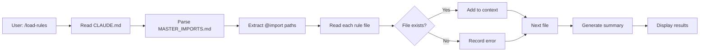
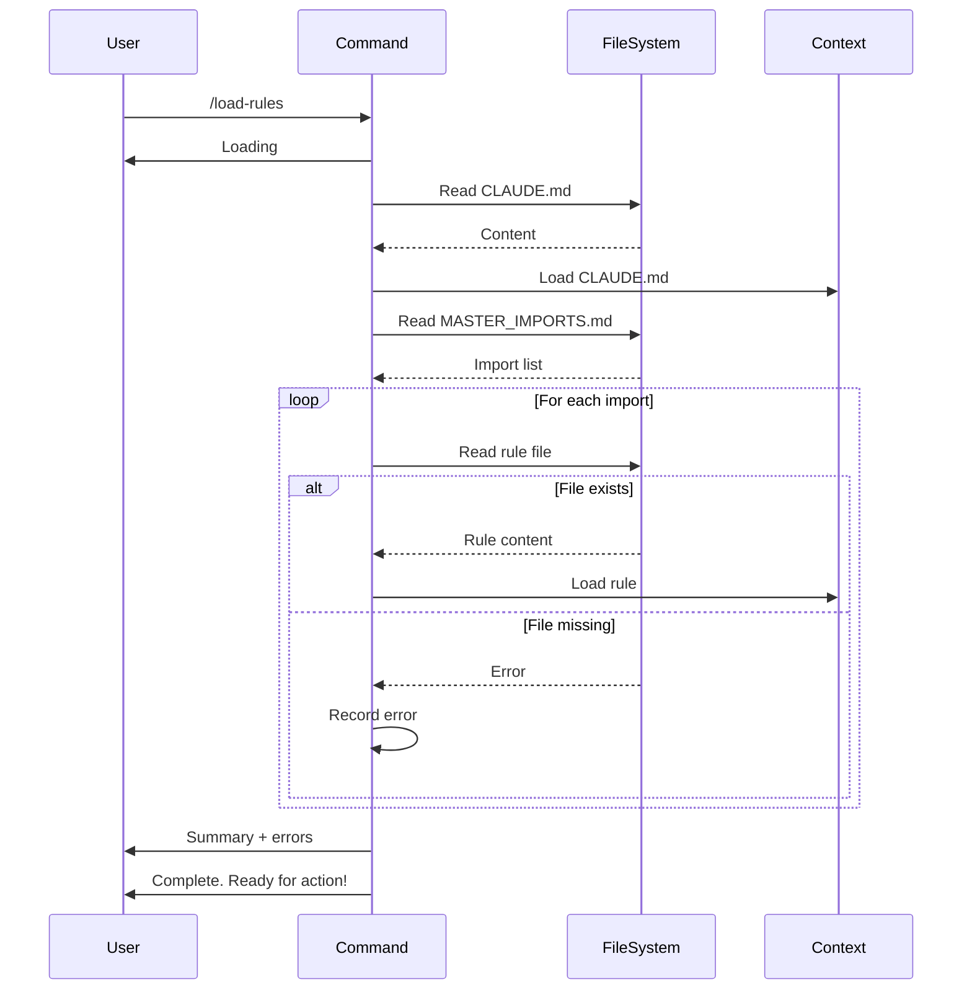

# Rule Loading Command Design Document

## Executive Summary
Design for a `/load-rules` command that ensures complete and proper loading of all Claude rules from CLAUDE.md and its imports. This command addresses the current limitation where @import statements in CLAUDE.md are only text references that require manual reading of each file to fully load rules into Claude's context.

## Requirements

### Functional Requirements
- **Command Name**: `/load-rules` (no aliases for now)
- **Scope**: Load ALL rules from CLAUDE.md and all @import statements
- **Feedback**: Report "Loading" at start and "Complete. Ready for action!" at end
- **Error Handling**: Continue loading remaining rules on failure, report errors at end
- **Validation**: Check files exist and are readable only

### Non-Functional Requirements
- **Simplicity**: Minimize implementation complexity
- **Graceful Degradation**: Continue operation despite individual rule failures
- **Consistency**: Follow existing command documentation patterns
- **Documentation**: Must be referenced in main README as crucial for agent performance

### Out of Scope (Future Enhancements)
- Selective rule loading by category
- Token count metrics
- Context window size reporting
- Rule validation beyond file existence
- Context window clearing functionality
- Performance metrics

## Current State Analysis

### Existing Patterns
1. **Command Structure**: Commands in `.claude/commands/` follow consistent format:
   - Command name and description
   - Usage examples
   - Process steps
   - Error handling

2. **Rule Loading Process**: Currently manual:
   - CLAUDE.md contains @import statements
   - Each import must be manually read
   - No verification of complete loading

3. **Rule Organization**:
   - Rules organized in categories (git/, project/, python/, etc.)
   - Each rule has metadata section
   - Master imports file lists all active rules

## Proposed Design

### Overview
The `/load-rules` command will automate the complete rule loading process by:
1. Reading CLAUDE.md
2. Parsing @import statements from MASTER_IMPORTS.md
3. Reading each imported rule file
4. Reporting success/failure
5. Confirming readiness

### Architecture

#### Component Flow


#### Process Sequence


### Design Decisions

#### Decision 1: No Context Window Management
**Choice**: Do not attempt to clear previous context
**Rationale**: 
- Claude Code's context window management is opaque
- No documented API for clearing specific content
- Risk of unintended side effects
- Simpler implementation

#### Decision 2: Graceful Error Handling
**Choice**: Continue loading on individual file failures
**Rationale**:
- Partial rule loading better than complete failure
- User gets visibility into what loaded successfully
- Allows operation with missing/broken rules
- Can manually address specific failures

#### Decision 3: Minimal Validation
**Choice**: Only validate file existence and readability
**Rationale**:
- Reduces complexity
- Faster execution
- Rule structure validation can be separate command
- Focus on core functionality first

## Alternative Approaches Considered

### Alternative 1: Strict Loading Mode
**Approach**: Fail entire operation if any rule fails to load
**Pros**: 
- Ensures complete rule set
- Predictable behavior
**Cons**: 
- Single missing file blocks all rules
- Poor user experience
**Decision**: Rejected - too rigid for practical use

### Alternative 2: Automatic Loading at Start
**Approach**: Automatically load rules when CLAUDE.md is read
**Pros**: 
- No manual intervention needed
- Always have rules loaded
**Cons**: 
- No visibility into process
- Can't reload during conversation
- No error reporting
**Decision**: Rejected - lacks transparency and control

### Alternative 3: Compiled Rules File
**Approach**: Compile all rules into single file
**Pros**: 
- Single read operation
- Faster loading
**Cons**: 
- Loses modularity
- Harder to maintain
- Very large file
**Decision**: Rejected - sacrifices maintainability

## Implementation Plan

### High-Level Tasks
1. Create command documentation file
2. Define command behavior and examples
3. Document error scenarios
4. Add reference to main README
5. Test with various error conditions

### Command Documentation Structure
```markdown
# Load Rules Command

## Command: /load-rules

## Description
Load or reload all Claude rules from CLAUDE.md and its imports

## Process
1. Display "Loading"
2. Read CLAUDE.md
3. Read .claude/MASTER_IMPORTS.md
4. Parse @import statements
5. Read each imported rule file
6. Report any failures
7. Display "Complete. Ready for action!"

## Usage
```
User: /load-rules
```

## Output Example
[Success and error examples]

## Error Handling
[Error scenarios and responses]
```

## Risks and Mitigations

### Risk 1: Large Rule Sets
**Risk**: Many rules could consume significant context
**Mitigation**: 
- Report number of rules loaded
- Future: selective loading feature

### Risk 2: Malformed Import Paths
**Risk**: Invalid @import syntax breaks parsing
**Mitigation**: 
- Robust regex parsing
- Report unparseable lines

### Risk 3: Circular Dependencies
**Risk**: Rules importing each other
**Mitigation**: 
- Track loaded files
- Skip already loaded rules

## Success Criteria
- Command successfully loads all valid rule files
- Clear feedback on loading progress (start/end)
- Graceful handling of missing files
- Errors reported clearly at end
- Command documented and referenced in README
- Consistent with existing command patterns

## Validation Checklist
- [x] Requirements gathered and documented
- [x] Multiple design alternatives considered
- [x] Trade-offs explicitly documented
- [x] Integration points identified
- [x] Risks assessed with mitigations
- [x] Diagrams show system flow
- [x] Design follows existing patterns
- [x] Implementation tasks identified
- [x] Design ready for implementation