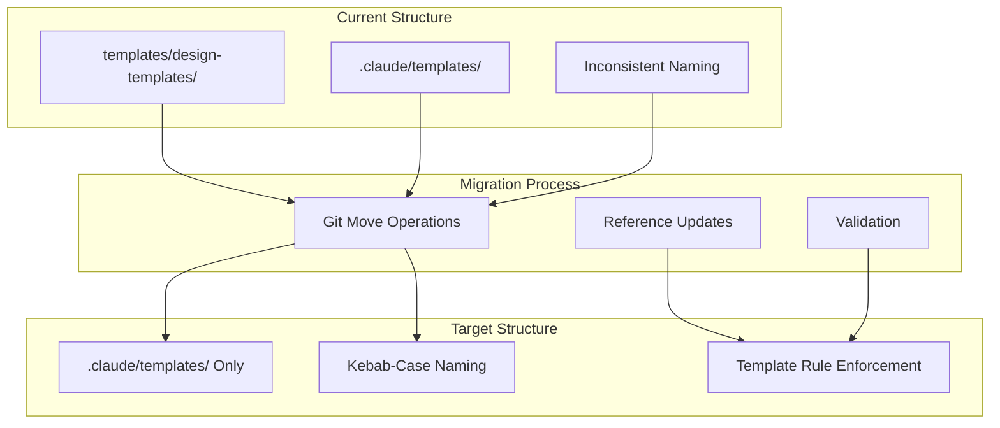

# Template Consolidation and Standardization Design Document

## Executive Summary

This design documents the consolidation of all Bootstrap framework templates into `.claude/templates/` with standardized kebab-case naming conventions. The migration involves moving 3 active templates, deleting 4 unused templates, updating only active references (not historical PRPs/designs), and creating a template management rule. This prepares the framework for alpha release and enables clean project generation.

## Requirements

### Functional Requirements
- Move active templates (ADR, README, feature-design) from `templates/design-templates/` to `.claude/templates/`
- Delete unused templates (fix-design, refactor-design, spike-design, system-design)
- Standardize naming to kebab-case format (except README.template.md)
- Create template management rule for enforcement
- Update only active references (rules/docs, not PRPs/designs which are historical records)

### Non-Functional Requirements
- Preserve git history for moved files
- Maintain backward compatibility until all references updated
- Zero downtime during migration
- Clear documentation of new standards

## Current State Analysis

### Existing Template Locations
1. **templates/design-templates/** (7 templates total)
   - Active: adr.template.md, README.template.md, feature-design.template.md
   - Unused: fix-design, refactor-design, spike-design, system-design

2. **.claude/templates/** (14 templates)
   - Already kebab-case: feature-quick, feature-enhanced, planning, prp-base, rule-doc, rule, task-commit, task-discovered, task
   - Need renaming: branch-name.template, changelog-entry.template, commit-message.template, config-section.template.yaml, command.template.md

### Files Referencing Templates
- **Active references to update** (2 files): 
  - `.claude/rules/project/adr-management.md`
  - `.claude/docs/rules/project/adr-management.md`
- **Historical references NOT updated** (7+ files): PRPs and design documents
- **Git templates** (15 files): Already follow naming convention

## Proposed Design

### Overview
Implement a three-phase migration:
1. **Phase 1**: Move and rename templates with git history preservation
2. **Phase 2**: Update all references across the codebase
3. **Phase 3**: Create enforcement rule and validate

### Architecture



### Detailed Migration Plan

#### Templates to Move
```yaml
Source → Target:
  templates/design-templates/adr.template.md → .claude/templates/adr.template.md
  templates/design-templates/README.template.md → .claude/templates/README.template.md
  templates/design-templates/feature-design.template.md → .claude/templates/feature-design.template.md
```

#### Templates to Delete
```yaml
Remove:
  - templates/design-templates/fix-design.template.md
  - templates/design-templates/refactor-design.template.md
  - templates/design-templates/spike-design.template.md
  - templates/design-templates/system-design.template.md
```

#### Templates to Rename (in .claude/templates/)
```yaml
Rename:
  branch-name.template → branch-name.template
  changelog-entry.template → changelog-entry.template
  commit-message.template → commit-message.template
  config-section.template.yaml → config-section.template.yaml
  command.template.md → command.template.md (already correct)
```

Note: Most templates already follow the pattern and don't need renaming.

### Template Management Rule

Create `.claude/rules/project/template-management.md`:
```markdown
# Template Management Rule

## When to Apply
When creating or managing templates in the Bootstrap framework.

## Rule Requirements
- location: All templates MUST be in .claude/templates/
- naming: {kebab-case-name}.template.{ext}
- exception: README.template.md keeps uppercase
- extensions: .md, .yaml, or no extension

## Actions
- enforce_location: true
- enforce_naming: true
- auto_fix: false
```

## Alternative Approaches Considered

### Alternative 1: Keep Dual Locations
**Approach**: Maintain templates in both locations with symlinks
**Pros**: No breaking changes, gradual migration
**Cons**: Confusion, maintenance overhead, inconsistency
**Decision**: Rejected - Clean migration is better long-term

### Alternative 2: Flatten All Templates
**Approach**: Remove all subdirectories, put all templates at root of .claude/templates/
**Pros**: Simpler structure
**Cons**: Loses logical grouping possibilities
**Decision**: Accepted - Simpler is better for templates

### Alternative 3: Category Subdirectories
**Approach**: Create subdirectories like .claude/templates/design/, .claude/templates/git/
**Pros**: Better organization
**Cons**: More complex, harder to find templates
**Decision**: Rejected - Keep flat structure for now

## Implementation Plan

### Phase 1: Template Migration (Tasks 1-4)
1. Move adr.template.md using git mv
2. Move README.template.md using git mv  
3. Move feature-design.template.md using git mv
4. Delete 4 unused templates using git rm

### Phase 2: Reference Updates (Tasks 5-6)
5. Update .claude/rules/project/adr-management.md (line 22)
6. Update .claude/docs/rules/project/adr-management.md (line 237)
Note: NOT updating PRPs or design documents - they are historical records

### Phase 3: Standardization (Tasks 7-9)
7. Rename templates in .claude/templates/ (if needed)
8. Create template-management.md rule
9. Run validation checks

### Phase 4: Cleanup (Task 10)
10. Remove empty templates/ directory structure

## Risks and Mitigations

### Technical Risks
- **Risk**: Breaking existing commands/PRPs that reference templates
  - **Mitigation**: Update all references before removing old locations
  - **Validation**: Grep for any remaining references

- **Risk**: Git history loss during moves
  - **Mitigation**: Use git mv exclusively
  - **Validation**: Check git log --follow

- **Risk**: Tests failing due to changed paths
  - **Mitigation**: Update test files as part of Phase 2
  - **Validation**: Run test suite after updates

### Project Risks
- **Risk**: Confusion during transition period
  - **Mitigation**: Complete migration in single session
  - **Documentation**: Update README immediately

## Success Criteria

### Validation Checklist
- [ ] All active templates moved to .claude/templates/
- [ ] Unused templates deleted
- [ ] All templates follow naming convention (except README)
- [ ] Active references updated (2 files: rules and docs)
- [ ] PRPs/designs left unchanged (historical records)
- [ ] Template management rule created
- [ ] Git history preserved for moved files
- [ ] Empty templates/ directory removed

### Verification Commands
```bash
# Check all templates are in correct location
ls -la .claude/templates/ | grep template

# Verify no references to old locations in active files
grep -r "templates/design-templates" .claude/ --exclude-dir=.git
# Expected: No matches (PRPs still have historical references)

# Confirm git history preserved
git log --follow .claude/templates/adr.template.md

# Check naming convention
ls .claude/templates/ | grep -v "README" | grep -E "^[a-z-]+\.template"
```

## Architecture Decision Records

### ADR-001: Flat Template Structure

**Status**: Accepted

**Context**: Templates can be organized flat or in subdirectories.

**Decision**: Use flat structure in .claude/templates/ without subdirectories.

**Consequences**:
- **Positive**: Simple to find templates, easy to list all
- **Negative**: May become cluttered with many templates
- **Neutral**: Can add subdirectories later if needed

### ADR-002: README Naming Exception

**Status**: Accepted

**Context**: Kebab-case naming vs human-readable README convention.

**Decision**: Allow README.template.md to keep uppercase for human readability.

**Consequences**:
- **Positive**: Follows universal README convention
- **Negative**: Inconsistent with other templates
- **Neutral**: Single documented exception

## Next Steps

After design approval:
1. Generate PRP with detailed commands
2. Execute migration in single session
3. Update documentation
4. Announce changes to team

---
*Design completed: 2025-09-01*