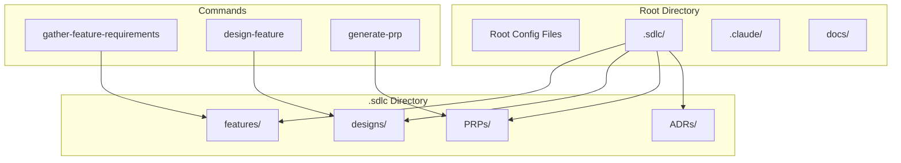
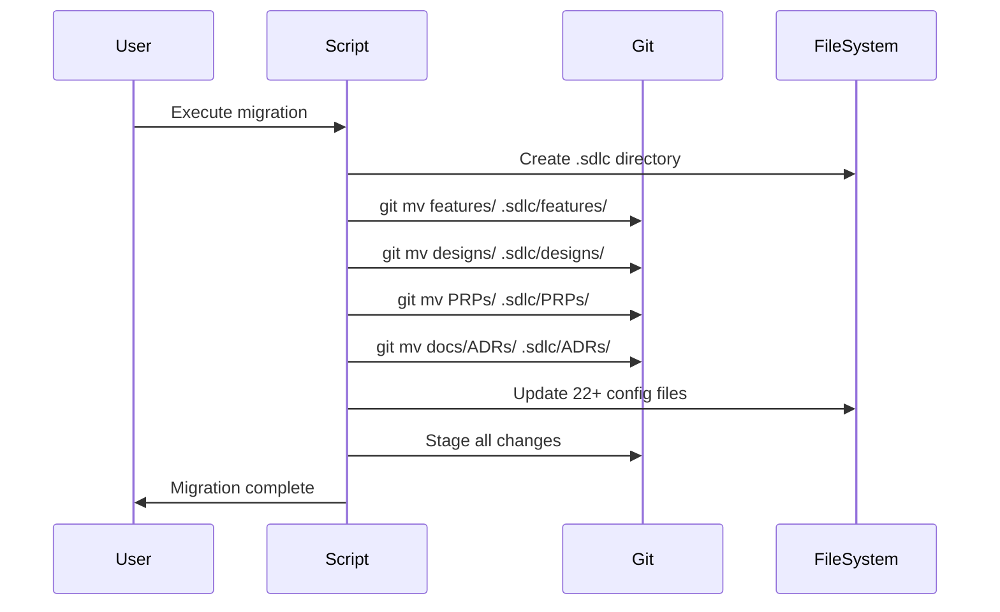

# SDLC Directory Consolidation Design Document

## Executive Summary
This design consolidates all Bootstrap framework SDLC artifacts (features, designs, PRPs, ADRs) into a single `.sdlc/` directory to create a cleaner project structure for alpha release. The migration will move ~100 existing files, update 25+ configuration files to reference new paths, create an enforcement rule, and remove the unmaintained ADR INDEX.md file. Total implementation involves 34 tasks across 5 phases.

## Requirements

### Functional Requirements
- Move all feature specifications from `features/` to `.sdlc/features/`
- Move all design documents from `designs/` to `.sdlc/designs/`
- Move all PRPs from `PRPs/` to `.sdlc/PRPs/`
- Move all ADRs from `docs/ADRs/` to `.sdlc/ADRs/`
- Update all commands to create new files in `.sdlc/` subdirectories
- Update all rules to reference new paths
- Preserve git history for all moved files
- Maintain sequential numbering system

### Non-Functional Requirements
- **Performance**: Migration should complete in under 1 minute
- **Reliability**: All file references must be updated atomically
- **Maintainability**: Clear separation between SDLC artifacts and source code
- **Usability**: Hidden directory reduces visual clutter

## Current State Analysis

### Existing Structure
```
Bootstrap/
├── features/          (19 files)
├── designs/           (18 directories)
├── PRPs/              (20+ files)
├── docs/
│   └── ADRs/         (11 files)
├── .claude/          (framework config)
├── scripts/          (utilities)
├── tests/            (test files)
└── [other files]
```

### Files Requiring Updates (25+ identified via comprehensive grep)
1. `.claude/rules/project/adr-management.md` - ADR paths, remove INDEX.md reference
2. `.claude/docs/rules/project/adr-management.md` - ADR documentation, add organizational info
3. `.claude/commands/generate-prp.md` - PRP generation paths
4. `.claude/commands/gather-feature-requirements.md` - Feature paths
5. `.claude/commands/quick-feature.md` - Feature paths
6. `.claude/commands/design-feature.md` - Design paths
7. `.claude/rules/project/sequential-file-naming.md` - Directory references
8. `.claude/docs/rules/project/sequential-file-naming.md` - Documentation
9. `.claude/rules/project/design-structure.md` - Design organization
10. `.claude/docs/framework/workflow.md` - Example paths
11. `.claude/docs/framework/getting-started.md` - Example paths
12. `.claude/docs/framework/command-system.md` - Example paths
13. `.claude/templates/feature-design.template.md` - Path references
14. `.claude/templates/feature-enhanced.template.md` - Path references
15. `.claude/templates/prp-base.template.md` - Path references

## Proposed Design

### Overview
Create a `.sdlc/` hidden directory at the project root that consolidates all SDLC artifacts. The dot-prefix indicates framework-managed content, similar to `.git/` or `.vscode/`.

### Architecture

#### Directory Structure
```
Bootstrap/
├── .sdlc/                    [NEW - Hidden SDLC directory]
│   ├── features/            [MOVED from root]
│   │   └── ###-*.md
│   ├── designs/             [MOVED from root]
│   │   └── ###-*/
│   ├── PRPs/                [MOVED from root]
│   │   └── *.md
│   └── ADRs/                [MOVED from docs/]
│       └── ADR-###-*.md
├── .claude/                 [UNCHANGED]
├── docs/                    [KEPT - minus ADRs]
├── scripts/                 [UNCHANGED]
├── tests/                   [UNCHANGED]
└── [root files]            [UNCHANGED]
```

#### Component Diagram


### Migration Sequence


### Design Decisions
1. **Hidden Directory**: Using `.sdlc` prefix to indicate framework-managed content
2. **Single Consolidation Point**: All SDLC artifacts in one location
3. **Preserve Git History**: Use `git mv` for all moves
4. **No Symlinks**: Direct path updates instead of compatibility symlinks
5. **ADR Relocation**: Move from `docs/ADRs/` to `.sdlc/ADRs/` for consistency
6. **Directory Structure Enforcement**: Create new rule to enforce `.sdlc/` usage:
   ```yaml
   # .claude/rules/project/sdlc-directory-structure.md
   trigger: ["create file", "save file", "move file"]
   locations:
     features: ".sdlc/features/"
     designs: ".sdlc/designs/"
     prps: ".sdlc/PRPs/"
     adrs: ".sdlc/ADRs/"
   validations:
     - no_root_sdlc_files: true  # Prevent features/, designs/, PRPs/ at root
     - enforce_structure: true
   priority: 700  # High priority to override other rules
   ```

## Alternative Approaches Considered

### Alternative 1: Visible Directory
- Use `project-files/` or `sdlc/` without dot-prefix
- **Pros**: Always visible, no hidden file settings needed
- **Cons**: Clutters root directory, less clear it's framework-managed
- **Decision**: Rejected - hidden directory better indicates framework ownership

### Alternative 2: Nested Under .claude
- Place under `.claude/project/` or `.claude/sdlc/`
- **Pros**: Everything framework-related in one place
- **Cons**: Mixes configuration with project artifacts, deeper nesting
- **Decision**: Rejected - SDLC artifacts are project content, not config

### Alternative 3: Keep Current Structure
- Leave directories at root level
- **Pros**: No migration needed, familiar structure
- **Cons**: Cluttered root, unclear organization
- **Decision**: Rejected - doesn't meet alpha cleanup goals

## Implementation Plan

### Phase 1: Preparation (6 tasks)
1. Run comprehensive grep to find all path references:
   ```bash
   grep -r "features/\|designs/\|PRPs/\|docs/ADRs/" . --include="*.md" --include="*.yaml" --include="*.py"
   ```
2. Create `.sdlc/` directory structure
3. Verify all 100+ files to be moved
4. Git commit current state (serves as rollback point)
5. Extract ADR organizational info from INDEX.md to adr-management docs
6. Create migration checklist with exact line numbers

### Phase 2: Migration (5 tasks)
7. Move `features/` to `.sdlc/features/` using git mv
8. Move `designs/` to `.sdlc/designs/` using git mv
9. Move `PRPs/` to `.sdlc/PRPs/` using git mv
10. Move `docs/ADRs/` to `.sdlc/ADRs/` using git mv (excluding INDEX.md)
11. Remove `docs/ADRs/INDEX.md` (no auto-update mechanism exists)

### Phase 3: Create Enforcement & Update References (16+ tasks)
12. Create `.claude/rules/project/sdlc-directory-structure.md` (enforce .sdlc/ usage)
13. Update `.claude/rules/project/adr-management.md` (remove INDEX.md ref, update paths)
14. Update `.claude/docs/rules/project/adr-management.md` (add ADR organization info)
15. Update `.claude/commands/generate-prp.md`
16. Update `.claude/commands/gather-feature-requirements.md`
17. Update `.claude/commands/quick-feature.md`
18. Update `.claude/commands/design-feature.md`
19. Update `.claude/rules/project/sequential-file-naming.md`
20. Update `.claude/docs/rules/project/sequential-file-naming.md`
21. Update `.claude/rules/project/design-structure.md`
22. Update `.claude/docs/framework/workflow.md`
23. Update `.claude/docs/framework/getting-started.md`
24. Update `.claude/docs/framework/command-system.md`
25. Update template files with path references (3 files)
26. Update any remaining references found via grep

### Phase 4: Validation (5 tasks)
27. Test `/gather-feature-requirements` creates in `.sdlc/features/`
28. Test `/design-feature` creates in `.sdlc/designs/`
29. Test `/generate-prp` creates in `.sdlc/PRPs/`
30. Verify sequential numbering still works
31. Verify git history preserved for all files

### Phase 5: Cleanup (3 tasks)
32. Remove empty directories
33. Update `.gitignore` if needed
34. Create `.sdlc/README.md` explaining structure

## Rollback Strategy

Git serves as our rollback mechanism:
1. **Before migration**: Commit all changes (Phase 1, task 4)
2. **If migration fails**: `git reset --hard HEAD`
3. **If partially complete**: `git status` to see state, then reset
4. **Recovery**: All changes are atomic within git

## Risks and Mitigations

### Technical Risks
1. **Broken References**
   - Risk: Missing a file reference causing command failures
   - Mitigation: Comprehensive grep search before migration (Phase 1, task 1)
   - Mitigation: Test all commands after migration
   - Mitigation: Systematic validation of each component

2. **Git History Loss**
   - Risk: Using wrong move command loses history
   - Mitigation: Use `git mv` exclusively
   - Mitigation: Verify with `git log --follow`

3. **Hidden Directory Issues**
   - Risk: Users can't find their files in VS Code
   - Mitigation: Add README.md in .sdlc explaining structure
   - Mitigation: Document VS Code settings to show hidden files
   - Mitigation: Update getting-started guide with clear instructions

4. **Cross-Reference Breakage**
   - Risk: Internal references between PRPs/designs may break
   - Mitigation: These are historical documents, won't be updated
   - Mitigation: Future documents will use new paths

### Project Risks
1. **Incomplete Migration**
   - Risk: Some files not moved or references not updated
   - Mitigation: Create detailed checklist
   - Mitigation: Systematic validation of each component

2. **User Confusion**
   - Risk: Existing users confused by new structure
   - Mitigation: Clear documentation in CHANGELOG
   - Mitigation: Update all getting-started guides

## Success Criteria
- [ ] All 100+ SDLC files moved to `.sdlc/` directory
- [ ] All 25+ configuration files updated with new paths
- [ ] ADR INDEX.md removed and organizational info preserved in rules
- [ ] Git history preserved for all moved files (verify with `git log --follow`)
- [ ] SDLC directory structure rule created and enforcing new paths
- [ ] All commands create files in correct new locations
- [ ] Sequential numbering continues to work
- [ ] No broken references found via grep search
- [ ] No orphaned references in scripts/ directory
- [ ] Root directory significantly cleaner (only docs/, scripts/, tests/ remain)
- [ ] Cannot accidentally create features/, designs/, PRPs/ at root level
- [ ] VS Code shows .sdlc/ directory properly
- [ ] `.sdlc/README.md` created with structure explanation
- [ ] All validation tests pass

## Next Steps
1. Review and approve this design
2. Generate PRP using `/generate-prp designs/019-sdlc-directory-consolidation/design.md`
3. Execute PRP to implement migration
4. Update CHANGELOG.md with structural changes
5. Update getting-started documentation

---
*Design document for SDLC directory consolidation - Ready for PRP generation*