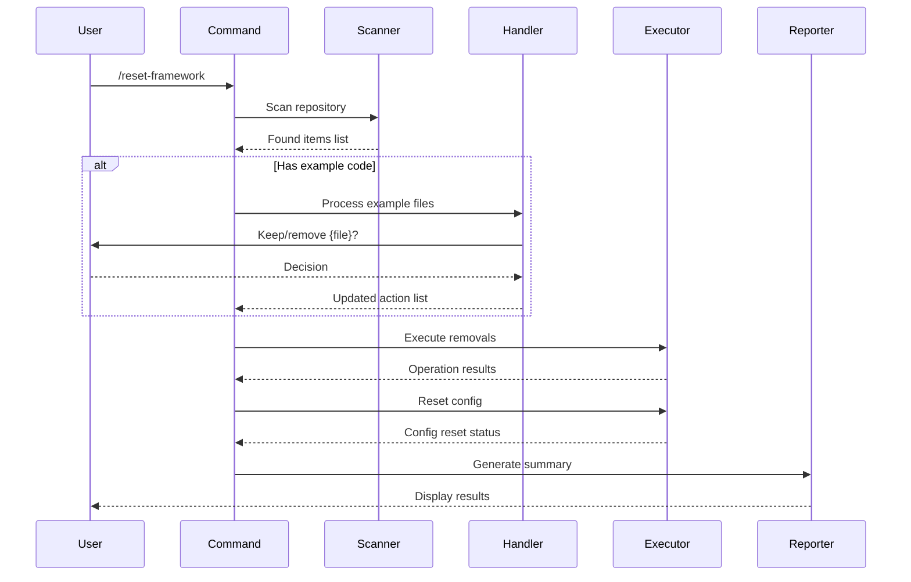

# Reset Framework Command Design Document

## Executive Summary

Design for a Claude command `/reset-framework` that removes all Bootstrap development history and artifacts, preparing the framework for use in new projects. This command is the final preparation step before alpha testing, ensuring developers receive a clean, functional framework without Bootstrap's development baggage.

## Requirements

### Functional Requirements
- Remove all Bootstrap development artifacts (.sdlc/, TASK.md, CHANGELOG.md, etc.)
- Delete git repository history completely
- Reset configuration files to generic defaults
- Detect and interactively handle example code files
- Verify framework integrity remains intact
- Provide summary of actions taken

### Non-Functional Requirements
- **Performance**: Complete within 30 seconds
- **Reliability**: Handle missing files and permission errors gracefully
- **Portability**: Work on Linux, Mac, and Windows platforms
- **Usability**: Clear feedback during execution
- **Safety**: No data loss of user's example code without confirmation

## Current State Analysis

### Existing Patterns
The Bootstrap framework uses:
- Command pattern in `.claude/commands/` directory
- Markdown-based command definitions
- Simple execution flow (load → process → report)
- No existing cleanup or reset commands

### Integration Points
- File system operations (reading, deleting directories/files)
- Git operations (checking for .git directory)
- Configuration file manipulation (resetting config.yaml)
- User interaction (prompting for example code handling)

## Proposed Design

### Overview

The `/reset-framework` command will be implemented as a Claude command that systematically removes Bootstrap development artifacts while preserving the framework's functionality. It uses a phased approach with verification at each step.

### Architecture

#### Command Structure
```
/reset-framework
├── Phase 1: Discovery & Analysis
│   ├── Scan repository structure
│   ├── Identify Bootstrap artifacts
│   └── Detect potential user code
├── Phase 2: Interactive Resolution
│   ├── Present findings to user
│   └── Handle example code decisions
├── Phase 3: Execution
│   ├── Remove SDLC artifacts
│   ├── Delete development files
│   ├── Clear git repository
│   └── Reset configuration
└── Phase 4: Verification & Reporting
    ├── Verify framework integrity
    └── Generate summary report
```

#### Component Responsibilities

1. **Scanner Component**
   - Traverses file system
   - Identifies files/directories for removal
   - Detects potential example code
   - Builds action list

2. **Interactive Handler**
   - Prompts user for example code decisions
   - Processes user responses
   - Updates action list based on decisions

3. **Executor Component**
   - Performs file/directory deletions
   - Handles errors gracefully
   - Tracks success/failure of operations

4. **Configuration Reset Component**
   - Loads default template
   - Replaces current config.yaml
   - Preserves framework functionality

5. **Reporter Component**
   - Generates operation summary
   - Lists removed items
   - Reports verification status

### Data Flow



### Design Decisions

#### Decision 1: Command Implementation Approach
**Options Considered:**
1. External Python script
2. Claude command in markdown
3. Bash script

**Decision:** Claude command in markdown
**Rationale:** 
- Consistent with existing framework patterns
- No additional dependencies
- Integrated with Claude's context

#### Decision 2: Example Code Detection Strategy
**Options Considered:**
1. Whitelist approach (only remove known Bootstrap files)
2. Blacklist approach (remove everything except framework)
3. Interactive approach (ask about unknowns)

**Decision:** Interactive approach
**Rationale:**
- Safest for user data
- Handles edge cases gracefully
- Provides user control

## Alternative Approaches Considered

### Alternative 1: Two-Command Approach
Split into `/analyze-cleanup` and `/execute-cleanup` commands.
- **Pros**: More control, preview before execution
- **Cons**: More complex, requires state management
- **Rejected because**: Single command is simpler and sufficient

### Alternative 2: Configuration File Approach
Use a cleanup.yaml file to define what to remove.
- **Pros**: Configurable, reusable
- **Cons**: Adds complexity, requires maintenance
- **Rejected because**: Requirements are well-defined and stable

## Implementation Plan

### Command Implementation
The command has been created at `.claude/commands/reset-framework.md` following the Bootstrap command patterns. The implementation includes:

#### Command Structure Verification
- ✅ Command follows markdown-based pattern
- ✅ Located in `.claude/commands/` directory  
- ✅ Named `/reset-framework` as specified
- ⚠️ Needs to follow command template structure more closely

#### Requirements Coverage Analysis

| Requirement | Implemented | Location in Command |
|------------|-------------|-------------------|
| Remove .sdlc/ | ✅ Yes | Phase 3, Step 4 |
| Remove TASK.md, CHANGELOG.md, etc. | ✅ Yes | Phase 3, Step 5 |
| Remove PLANNING.md, README.md | ✅ Yes | Phase 3, Step 5 |
| Remove responses/ | ✅ Yes | Phase 3, Step 6 |
| Remove .git/ | ✅ Yes | Phase 3, Step 6 |
| Reset config.yaml | ✅ Yes | Phase 3, Step 7 |
| Interactive example code handling | ✅ Yes | Phase 2, Step 3 |
| Already-clean detection | ✅ Yes | Output Examples |
| Preserve .claude/ | ✅ Yes | Phase 1, Step 2 |
| Preserve CLAUDE.md | ✅ Yes | Phase 1, Step 2 |
| Preserve AI_TRANSPARENCY.md | ✅ Yes | Phase 1, Step 2 |
| Preserve LICENSE | ✅ Yes | Phase 1, Step 2 |
| Preserve requirements.txt | ✅ Yes | Phase 1, Step 2 |
| Preserve .gitignore | ✅ Yes | Phase 1, Step 2 |
| Summary reporting | ✅ Yes | Phase 4, Step 9 |
| Error handling | ✅ Yes | Error Handling section |

### Implementation Tasks
1. ✅ Command file created at `.claude/commands/reset-framework.md`
2. ✅ Discovery logic documented in Phase 1
3. ✅ Interactive prompting documented in Phase 2
4. ✅ Removal operations documented in Phase 3
5. ✅ Configuration reset using template documented
6. ✅ Verification and reporting logic in Phase 4
7. ⚠️ Command template compliance needs review
8. ⚠️ Testing implementation needed

### Dependencies
- ✅ File system access (via Claude tools)
- ✅ User interaction capability (via prompts)
- ✅ Config template file (created at `.claude/templates/config-default.template.yaml`)

### Next Steps
1. Review command against template for compliance
2. Add proper argument handling structure
3. Ensure all error cases are handled
4. Create test scenarios for validation

## Risks and Mitigations

### Technical Risks

| Risk | Likelihood | Impact | Mitigation |
|------|------------|--------|------------|
| Permission errors on file deletion | Medium | Low | Continue operation, report failures |
| Platform-specific path issues | Low | Medium | Use platform-agnostic path handling |
| Incomplete cleanup due to structure changes | Low | Medium | Use pattern matching, not hard-coded paths |

### Project Risks

| Risk | Likelihood | Impact | Mitigation |
|------|------------|--------|------------|
| User accidentally runs on wrong project | Low | High | Check for Bootstrap markers before executing |
| Command fails partway through | Low | Medium | Make operations idempotent |

## Command Validation Against Requirements

### Systematic Feature Verification

| Feature Requirement | Command Implementation | Status |
|-------------------|----------------------|---------|
| **Scenario 1: Complete Development History Removal** | | |
| Remove .sdlc/ directory | `rm -rf .sdlc/` in Phase 3 | ✅ Implemented |
| Remove TASK.md | Listed in Phase 3, Step 5 | ✅ Implemented |
| Remove CHANGELOG.md | Listed in Phase 3, Step 5 | ✅ Implemented |
| Remove ROADMAP.md | Listed in Phase 3, Step 5 | ✅ Implemented |
| Remove CREDITS.md | Listed in Phase 3, Step 5 | ✅ Implemented |
| Remove PLANNING.md | Listed in Phase 3, Step 5 | ✅ Implemented |
| Remove README.md | Listed in Phase 3, Step 5 | ✅ Implemented |
| Remove responses/ | `rm -rf responses/` in Phase 3 | ✅ Implemented |
| **Scenario 2: Git Repository Reset** | | |
| Remove .git/ completely | `rm -rf .git/` in Phase 3 | ✅ Implemented |
| **Scenario 3: Configuration Reset** | | |
| Reset config.yaml to defaults | Copy template in Phase 3, Step 7 | ✅ Implemented |
| Template exists | Created at `.claude/templates/config-default.template.yaml` | ✅ Implemented |
| **Scenario 4: Framework Integrity** | | |
| Preserve .claude/ | Listed in preserve list | ✅ Implemented |
| Preserve CLAUDE.md | Listed in preserve list | ✅ Implemented |
| Preserve AI_TRANSPARENCY.md | Listed in preserve list | ✅ Implemented |
| Preserve LICENSE | Listed in preserve list | ✅ Implemented |
| Preserve requirements.txt | Listed in preserve list | ✅ Implemented |
| Preserve .gitignore | Listed in preserve list | ✅ Implemented |
| **Scenario 5: Already-Clean Handling** | | |
| Detect clean state | "Already Clean" output example | ✅ Implemented |
| Report verification | Summary in output | ✅ Implemented |
| **Scenario 6: Example Code Detection** | | |
| Identify code files | Phase 2, Step 3 | ✅ Implemented |
| Interactive prompt | "keep/remove" prompt shown | ✅ Implemented |
| User decision handling | Record and apply decisions | ✅ Implemented |

### Command Template Compliance

| Template Section | Command Status | Notes |
|-----------------|----------------|-------|
| Command Name | ✅ Present | "Reset Framework" |
| Arguments/Parameters | ⚠️ Missing | Should add "Arguments: None" |
| Brief Description | ✅ Present | Clear purpose stated |
| When to Use | ✅ Present | Use cases listed |
| Process/Workflow | ✅ Present | 4-phase structure |
| Output Structure | ⚠️ Partial | Examples given, not structure |
| Integration | ✅ Present | Related commands listed |
| Validation/Error Handling | ✅ Present | Dedicated section |
| Example Usage | ✅ Present | Multiple examples |
| Tips for Success | ⚠️ Missing | Should add tips section |
| Common Issues | ✅ Present | In error handling |

## Success Criteria

### Functional Success
- All Bootstrap development artifacts removed
- Framework remains fully functional
- Configuration reset to defaults
- User's example code preserved when requested

### Quality Metrics
- Command completes in < 30 seconds
- Zero data loss of user files
- Clear reporting of all actions
- Works on all major platforms

### Verification Method
1. Run command on fresh Bootstrap clone
2. Verify all specified files/directories removed
3. Test Claude commands still work
4. Verify config.yaml reset to defaults
5. Run command again to test idempotency

## Appendices

### Appendix A: Files and Directories to Remove

**Directories:**
- `.sdlc/` - All SDLC artifacts
- `responses/` - Informal response files
- `.git/` - Git repository

**Files:**
- `TASK.md` - Task management
- `CHANGELOG.md` - Version history
- `ROADMAP.md` - Development roadmap
- `CREDITS.md` - Attribution
- `PLANNING.md` - Project planning
- `README.md` - Project documentation

**Preserved:**
- `.claude/` - Framework core
- `CLAUDE.md` - Configuration
- `AI_TRANSPARENCY.md` - Disclosure
- `LICENSE` - Legal requirement
- `requirements.txt` - Dependencies
- `.gitignore` - Git configuration

### Appendix B: Default Configuration Template

Created at: `.claude/templates/config-default.template.yaml`
- Generic project name and description
- Default version 0.1.0
- Standard Python development settings
- Framework paths configured for .sdlc/