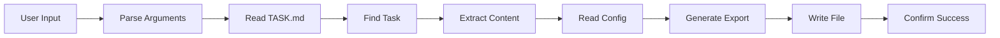

# Task Export Command Design Document

## Executive Summary

Design for an intelligent capture command that exports tasks, insights, and discovered issues from the current conversation or TASK.md to standalone markdown files. This enables real-time knowledge capture during Bootstrap framework testing, preserving discoveries about functionality and shortcomings as they occur. The command leverages Claude's natural language understanding to interpret contextual references like "what we were just talking about."

## Requirements

### Functional Requirements
- **Context-Aware Export**: Understand "what we were just talking about" and similar references
- **Dual Mode Operation**: 
  - Export existing tasks from TASK.md by ID
  - Capture current conversation context as new insights
- **Discovery Capture**: Record framework limitations, bugs, and improvement ideas as encountered
- **Intelligent Parsing**: Use NLP to extract key information from conversation
- **Categorization**: Automatically classify as bug, enhancement, limitation, or insight
- **Self-Contained Output**: Create markdown files that fully document the discovery
- **Project Context**: Include current project state and what was being attempted

### Non-Functional Requirements
- **Real-Time Capture**: Must not interrupt development flow
- **Context Preservation**: Maintain full context of discoveries
- **Natural Language**: Accept informal descriptions and references
- **Learning Oriented**: Format optimized for framework improvement
- **Cross-Project**: Easily shareable between Bootstrap instances

## Current State Analysis

### Existing Task Commands
The framework has four task-related commands:
- `task-add`: Creates new tasks with auto-generated IDs
- `task-update`: Modifies existing task status
- `task-summary`: Displays task overview
- `task-audit`: Reorganizes and validates tasks

### Patterns to Follow
1. **Argument Parsing**: Extract task ID from $ARGUMENTS
2. **File Reading**: Use Read tool to access TASK.md
3. **Task Location**: Search through sections (Current Tasks, Backlog, Completed)
4. **Metadata Format**: Consistent structure across all task commands
5. **Error Handling**: Simple error messages for missing items

### Integration Points
- Read from `.claude/config.yaml` for project name
- Parse TASK.md structure (sections, metadata, subtasks)
- Create output directory if needed
- Generate timestamp for export date

## Proposed Design

### Overview
The task-export command operates in two modes:

**Mode 1: Task Export** (Traditional)
1. Parse task ID from arguments (e.g., "TASK-030")
2. Extract from TASK.md and export

**Mode 2: Context Capture** (Primary Use)
1. Interpret natural language input ("what we just discussed", "this issue", "the bug we found")
2. Analyze recent conversation context
3. Extract key information:
   - What was being attempted
   - What went wrong or was discovered
   - Potential solutions or workarounds
   - Impact on framework
4. Generate categorized insight document
5. Save to exports/insights/ or exports/tasks/

### Architecture

#### Component Flow
```
User Input → Context Analyzer → Mode Selector → Content Processor → Insight Generator → File Writer
                     ↓
            [Conversation Context]
```

#### Key Components

1. **Context Analyzer**
   - Interpret natural language references
   - Scan recent conversation history
   - Identify discussion topics and issues
   - Determine export mode (task vs insight)

2. **Mode Selector**
   - Route to task export for TASK-XXX patterns
   - Route to context capture for natural language
   - Handle ambiguous inputs gracefully

3. **Content Processor**
   - For tasks: Extract from TASK.md
   - For insights: Process conversation context
   - Identify: Problem, Context, Impact, Solution
   - Categorize: Bug, Enhancement, Limitation, Discovery

4. **Insight Generator**
   - Create structured insight document
   - Include reproduction steps if applicable
   - Add framework version and context
   - Generate actionable recommendations
   - Create TASK.md entry if needed

5. **File Writer**
   - Determine appropriate directory (tasks/ or insights/)
   - Generate descriptive filename
   - Write formatted content
   - Optionally update TASK.md

### Data Flow



### Export File Formats

#### Format 1: Task Export (from TASK.md)
```markdown
# Exported Task: TASK-XXX
[Original format maintained]
```

#### Format 2: Insight Capture (from conversation)
```markdown
# Bootstrap Insight: {Generated Title}

**Type**: {Bug|Enhancement|Limitation|Discovery}
**Date Discovered**: YYYY-MM-DD
**Project**: {project.name}
**Framework Version**: {version}
**Severity**: {High|Medium|Low}

## Summary
{One-line description of the discovery}

## Context
**What was being attempted:**
{Description of the development task or goal}

**What happened:**
{Description of the issue or discovery}

## Details
{Full explanation with examples}

## Reproduction Steps (if applicable)
1. {Step 1}
2. {Step 2}
3. {Step 3}

## Impact
- **Development**: {How this affects development workflow}
- **Framework**: {Impact on Bootstrap framework}
- **Users**: {Impact on future users}

## Proposed Solution
{Suggested fix or enhancement}

## Workaround
{Temporary solution if available}

## Related Information
- **Files Affected**: {List of files}
- **Commands Used**: {List of commands}
- **Error Messages**: {Any error output}

## Action Items
- [ ] Create task in TASK.md
- [ ] Update documentation
- [ ] Implement fix
- [ ] Add to known issues

---
*Captured during Bootstrap framework testing*
*Export Command: `{original command used}`*
```

## Implementation Plan

### Phase 1: Basic Task Export (10 minutes)
1. Create command file structure
2. Implement TASK-XXX pattern detection
3. Add task extraction from TASK.md
4. Generate export file

### Phase 2: Context Capture (20 minutes)
1. Implement natural language parsing
2. Add conversation context analysis
3. Create insight categorization logic
4. Generate insight export format
5. Add intelligent title generation

### Phase 3: Integration (10 minutes)
1. Unify both modes under single command
2. Add mode selection logic
3. Test with various input types
4. Handle edge cases

### Suggested Implementation Order
1. Copy task-add.md as starting template
2. Modify to read instead of write TASK.md
3. Add export file generation logic
4. Test with various task types
5. Handle edge cases

## Design Decisions

### ADR-001: Natural Language Processing for Context
**Decision**: Use Claude's NLP to interpret contextual references
**Rationale**: Enables real-time capture without breaking development flow
**Consequences**: More complex than simple ID matching but provides significant value

### ADR-002: Dual-Mode Operation
**Decision**: Support both task export and insight capture in one command
**Rationale**: Unified interface for all knowledge export needs
**Consequences**: Slightly more complex parsing but better user experience

### ADR-003: Automatic Categorization
**Decision**: Auto-categorize discoveries as bug, enhancement, limitation, or insight
**Rationale**: Helps organize and prioritize framework improvements
**Consequences**: May need refinement based on usage patterns

## Risks and Mitigations

### Technical Risks
1. **Risk**: Malformed TASK.md structure
   - **Mitigation**: Graceful parsing with fallback to raw content
   
2. **Risk**: File system permissions
   - **Mitigation**: Clear error messages suggesting alternatives

### Project Risks
1. **Risk**: Feature scope creep
   - **Mitigation**: Stick to MVP for pre-alpha (single task export only)

## Success Criteria

- [ ] Successfully exports task with all metadata
- [ ] Handles missing tasks gracefully
- [ ] Creates self-contained markdown files
- [ ] Works with tasks from all sections
- [ ] Completes in under 1 second
- [ ] Follows existing command patterns

## Next Steps

1. Generate PRP from this design
2. Implement using task-add as template
3. Test with various task types
4. Document in command reference
5. Consider batch export for future enhancement

---
*Design document for task-export command feature*