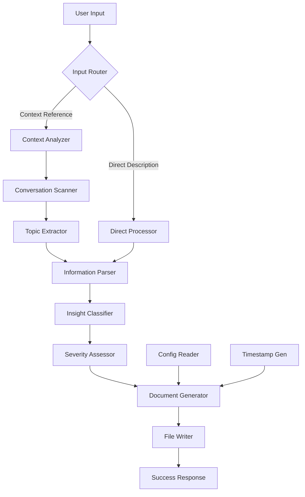
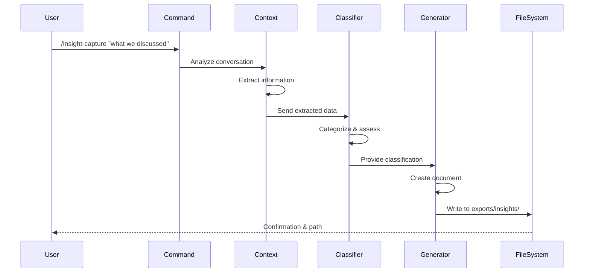

# Insight Capture Command Design Document

## Executive Summary

Design for an intelligent command that captures framework discoveries, bugs, and insights from the current conversation context using natural language processing. This command enables real-time documentation of Bootstrap framework limitations and improvements as they're discovered during development, without breaking flow. The primary goal is to preserve valuable knowledge that would otherwise be lost when switching between projects or Claude sessions.

## Requirements Analysis

### Core Requirements (from feature spec)
- **Natural Language Understanding**: Interpret references like "what we just discussed"
- **Auto-Categorization**: Classify as Bug, Enhancement, Limitation, or Discovery
- **Context Extraction**: Pull relevant information from conversation history
- **Structured Export**: Generate consistent, actionable documentation
- **Zero-Friction Capture**: Typically < 30 seconds from discovery to documentation

### Additional Clarifications Needed
Based on the requirements, the design is clear. The main architectural decision is how to structure the context analysis pipeline.

## Current State Analysis

### Existing Patterns in Bootstrap
1. **Command Structure**: All commands follow markdown format with clear sections
2. **Argument Parsing**: Commands extract from $ARGUMENTS variable
3. **File Operations**: Use Write tool for file creation
4. **Configuration Access**: Read from `.claude/config.yaml`
5. **Error Handling**: Simple, clear error messages

### No Similar Features
This is the first command to:
- Analyze conversation context
- Use natural language processing
- Auto-generate structured content from unstructured input

This makes it a pioneering feature that could establish patterns for future context-aware commands.

## Proposed Design

### Architecture Overview

The insight capture command uses a multi-stage pipeline to transform conversational context into structured documentation:

```
Input → Context Analysis → Classification → Content Generation → Export
```

### Component Architecture



### Key Components

#### 1. Input Router
**Responsibility**: Determine processing path based on input pattern
**Logic**:
- Detect context references: "this", "that", "what we discussed"
- Detect temporal references: "just now", "earlier", "recently"
- Route to appropriate processor

#### 2. Context Analyzer
**Responsibility**: Extract relevant information from conversation
**Process**:
1. Access full conversation history (Claude capability)
2. Scan recent exchanges (typically last 10, but can access entire session)
3. Identify technical discussions
4. Find problem statements with exact quotes
5. Extract attempted solutions
6. Note outcomes and errors verbatim

#### 3. Topic Extractor
**Responsibility**: Identify the main subject of discussion
**Techniques**:
- Keyword frequency analysis
- Command/file references
- Error message detection
- Framework component mentions

#### 4. Information Parser
**Responsibility**: Structure extracted information
**Extracts**:
- What was being attempted
- What went wrong
- Error messages or unexpected behavior
- Workarounds tried
- Potential solutions discussed

#### 5. Insight Classifier
**Responsibility**: Categorize the insight type
**Classification Rules**:
- **Bug**: Expected behavior doesn't match actual
- **Enhancement**: Missing functionality identified
- **Limitation**: Architectural constraint discovered
- **Discovery**: Unexpected capability or pattern found

#### 6. Severity Assessor
**Responsibility**: Determine impact level
**Assessment Criteria**:
- **High**: Blocks work, no workaround
- **Medium**: Slows development, workaround exists
- **Low**: Minor inconvenience

#### 7. Document Generator
**Responsibility**: Create structured markdown document
**Includes**:
- Generated title from topic
- All metadata fields
- Structured sections
- Actionable items

### Data Flow



## Alternative Approaches Considered

### Alternative 1: Template-Based Approach
**Description**: Use fixed templates with fill-in prompts
**Pros**:
- Simpler implementation
- Predictable output
- Less processing needed

**Cons**:
- Breaks development flow
- Loses context richness
- More user effort required

**Rejected because**: Defeats the purpose of zero-friction capture

### Alternative 2: Full AI Generation
**Description**: Let Claude generate completely free-form insights
**Pros**:
- Maximum flexibility
- Rich context preservation
- Natural expression

**Cons**:
- Inconsistent format
- Hard to parse later
- Not actionable

**Rejected because**: Need structured, actionable output

### Alternative 3: Hybrid Approach (Chosen)
**Description**: AI-powered extraction with structured output
**Pros**:
- Natural input handling
- Consistent output format
- Actionable results
- Preserves context

**Cons**:
- More complex implementation
- Requires careful prompt engineering

**Selected because**: Best balance of usability and structure

## Implementation Strategy

### Phase 1: Core Pipeline (20 min)
1. Create command file structure
2. Implement input routing logic
3. Add context scanning capability
4. Create basic classification rules

### Phase 2: Intelligence Layer (20 min)
1. Implement NLP reference resolution
2. Add topic extraction
3. Create severity assessment
4. Build document generator

### Phase 3: Polish (10 min)
1. Add error handling for edge cases
2. Create informative responses
3. Test with various input types
4. Optimize for common patterns

### Context Analysis Implementation

```markdown
## Context Analysis Process

IMPORTANT: Claude has full access to the entire conversation history in this session.
This is a core capability - use it confidently to extract context.

NOTE: If conversation is near compaction limit, older context may be lost. In such cases,
the command should gracefully fall back to requesting explicit description from the user.

1. **Scan Window**: Last 10 exchanges (or more if available)
2. **Context Access Method**:
   - Directly reference previous messages in conversation
   - Quote exact user words when relevant
   - Identify specific commands, errors, and discussions
   
3. **Priority Signals**:
   - Error messages
   - Command failures  
   - "doesn't work" phrases
   - "should" statements (expectations)
   - "but" statements (contradictions)

4. **Information Extraction**:
   - Commands used (exact syntax)
   - Files mentioned (full paths)
   - Error outputs (complete messages)
   - User frustrations (direct quotes)
   - Attempted solutions
```

### Ambiguity Resolution

```markdown
## Handling Ambiguous References

When context is unclear:
1. **No clear context found**: Prompt "Could not find recent technical discussion. Please describe the insight explicitly:"
2. **Multiple issues detected**: Default to most recent issue discussed
3. **Vague reference**: Use best guess based on keyword proximity
4. **Never ask for classification confirmation** (per ADR-002 - preserve flow)

Fallback strategy:
- If context analysis completely fails → Switch to interactive mode
- Request explicit description
- Process as direct input
```

### Title Generation Rules

```markdown
## Generating Descriptive Titles

1. Extract key nouns and verbs from insight summary
2. Limit to 5-7 words maximum
3. Remove common words (the, a, an, is, are)
4. Convert to kebab-case
5. Prioritize: command names, file names, error types

Examples:
- "config yaml has django settings" → "config-yaml-django-settings"
- "the /reset-framework command doesn't handle symlinks" → "reset-framework-symlinks-not-handled"
- "can't export tasks properly" → "task-export-failure"
```

### Interactive Mode

```markdown
## Interactive Mode (No Arguments)

When `/insight-capture` is run without arguments:
1. Prompt: "What insight would you like to capture? (describe the issue or say 'recent' for last discussion)"
2. Accept natural language or context reference
3. Process based on response type:
   - "recent" or similar → analyze last technical discussion
   - Direct description → process as explicit insight
4. Continue with normal pipeline
```

### Classification Heuristics

```markdown
## Classification Rules

### Bug Detection
- "doesn't work"
- "error" or "failure"
- "expected X but got Y"
- Command failures

### Enhancement Detection
- "would be nice"
- "should have"
- "missing"
- "need"

### Limitation Detection
- "can't"
- "unable"
- "not supported"
- "by design"

### Discovery Detection
- "found that"
- "discovered"
- "turns out"
- "actually works"
```

## Risk Assessment

### Technical Risks

| Risk | Likelihood | Impact | Mitigation |
|------|------------|--------|------------|
| Context misinterpretation | Medium | Low | Ask for confirmation on ambiguous cases |
| Missing important context | Low | Medium | Scan larger conversation window |
| Wrong categorization | Low | Low | User can edit exported file |

### Usability Risks

| Risk | Likelihood | Impact | Mitigation |
|------|------------|--------|------------|
| Too many prompts | Low | High | Minimize interactions, guess intelligently |
| Unclear references | Medium | Low | Provide examples in error messages |

## Success Criteria

- ✅ Captures insights typically in < 30 seconds
- ✅ Correctly categorizes 80%+ of insights
- ✅ Generates actionable documentation
- ✅ Preserves full context
- ✅ Works with natural language input
- ✅ Creates shareable artifacts
- ✅ Handles ambiguous references gracefully
- ✅ Generates descriptive, consistent titles

## Design Decisions

### ADR-001: Context Window Size
**Decision**: Scan last 10 conversation exchanges
**Rationale**: Balance between context completeness and processing efficiency
**Trade-offs**: May miss earlier context, but covers most discoveries

### ADR-002: Auto-Classification vs Confirmation
**Decision**: Auto-classify without confirmation for speed
**Rationale**: Prioritize flow preservation over perfect accuracy
**Trade-offs**: May misclassify occasionally, but maintains zero-friction goal

### ADR-003: File Organization Strategy
**Decision**: Use date-prefixed files in flat directory
**Rationale**: Simple to browse and sort chronologically
**Trade-offs**: May accumulate many files, but easy to find recent insights

## Next Steps

1. Generate PRP from this design
2. Implement the command
3. Test with real discovery scenarios
4. Iterate based on usage patterns
5. Consider batch insight processing for future

---
*Design complete and ready for PRP generation*