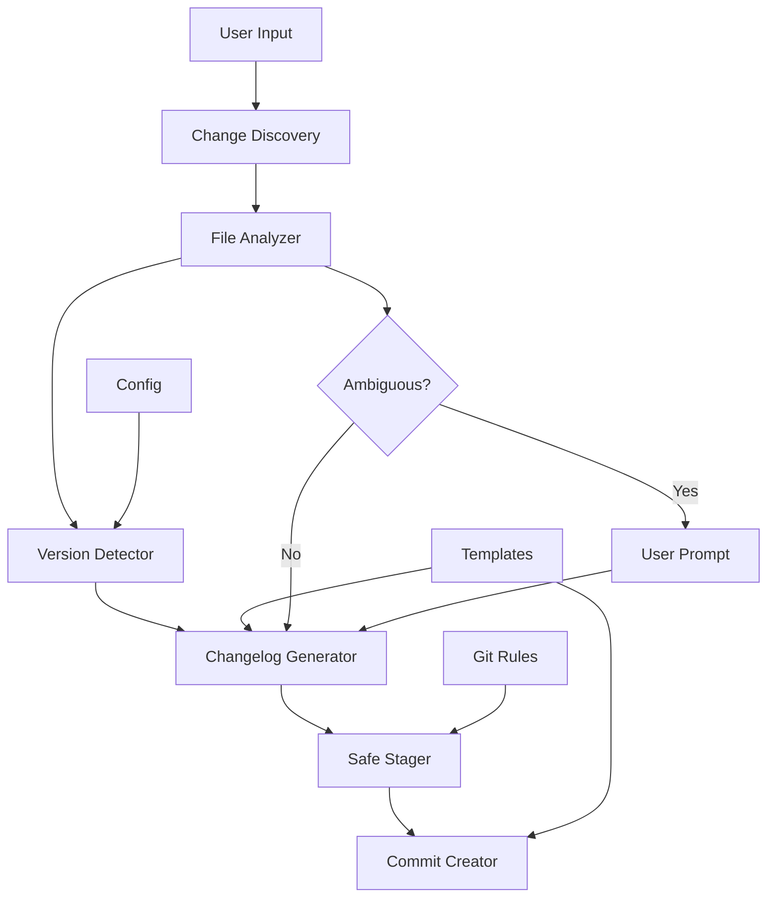
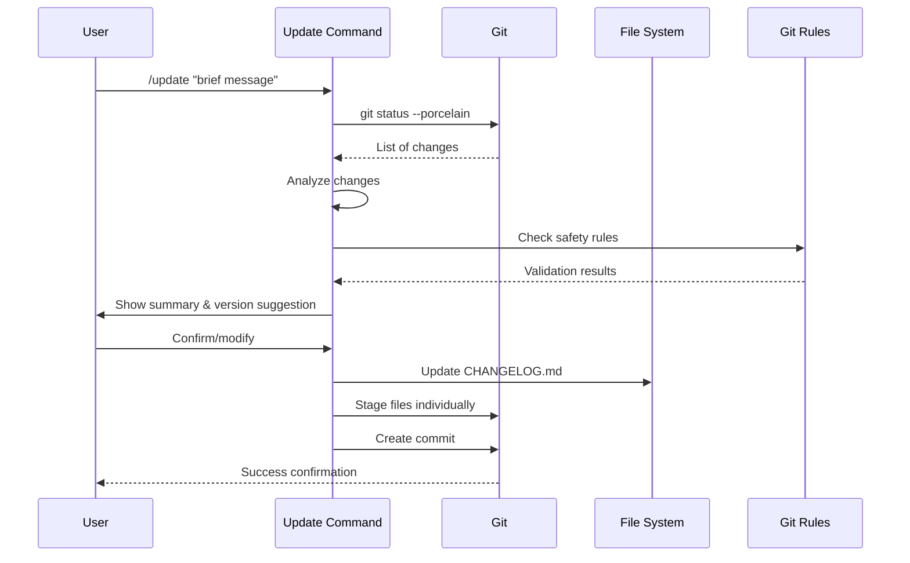

# Update Command Design Document

## Executive Summary

Design for a unified `/update` command that automates the complete project update workflow: discovering changes, analyzing for version bumps, updating changelog, staging files safely, and creating properly formatted commits. This command streamlines development by combining multiple manual steps into a single intelligent operation while maintaining all safety checks and project standards.

## Requirements Analysis

### Core Requirements (from feature spec)
- **Unified Workflow**: Single command for stage, changelog, and commit
- **Change Discovery**: Find all modified and untracked files repository-wide
- **Version Intelligence**: Auto-detect appropriate version bumps from changes
- **Changelog Automation**: Generate entries based on changes and commit message
- **Safety Enforcement**: Apply all git safety rules and file checks
- **Interactive Fallback**: Handle missing information gracefully

### Clarified Requirements
Based on user clarification:
1. **Version Detection**: Analyze brief input + file changes to suggest version bump
2. **Changelog Style**: Similar to commit message, summarizing all changes since last version
3. **Discovery Scope**: Entire repository respecting .gitignore (including .claude/ for Bootstrap)
4. **Batching Strategy**: Group intelligently but maintain understanding of changes
5. **Future Integration**: Task and insight capture integration deferred to backlog

## Current State Analysis

### Existing Patterns in Bootstrap
1. **Command Structure**: Markdown format with clear phases (see reset-framework, insight-capture)
2. **Git Safety**: Explicit file staging, no wildcards (git-add-safety rule)
3. **Changelog Management**: Keep a Changelog format with categories
4. **Version Management**: Semantic versioning in config.yaml
5. **Commit Format**: Conventional commits with type, scope, and body

### Related Components
- **Rules**: git-add-safety, git-commit-format, changelog-update, version-management
- **Templates**: changelog-entry.template, commit-message.template (to be created)
- **Commands**: Similar workflow patterns in task-add, task-update
- **Configuration**: Version stored in .claude/config.yaml

## Proposed Design

### Architecture Overview

The update command uses a multi-phase pipeline to ensure safe, comprehensive updates:

```
Discovery → Analysis → Version Detection → Changelog Generation → Staging → Commit
```

### Component Architecture



### Key Components

#### 1. Change Discovery Engine
**Responsibility**: Find all repository changes
**Implementation**:
- Execute `git status --porcelain` for complete change list
- Parse output to categorize: modified, untracked, deleted, renamed
- Execute `git diff --name-only` for staged changes already present
- Respect .gitignore patterns via git's built-in support
- Group files by directory and type for batch processing

#### 2. File Analyzer
**Responsibility**: Understand the nature of changes
**Process**:
- Categorize by file type (code, config, docs, tests)
- Detect patterns indicating change type (feat, fix, refactor)
- Check file sizes and binary status
- Apply safety rules (sensitive patterns, large files)
- Build change context for commit message generation

#### 3. Version Detector
**Responsibility**: Determine appropriate version bump
**Logic**:
```python
def detect_version_bump(input_arg, file_changes):
    # Parse input for explicit version or keywords
    if has_explicit_version(input_arg):
        return parse_version(input_arg)
    
    # Analyze changes for breaking/feature/fix patterns
    if has_breaking_changes(file_changes):
        return "major"
    elif has_new_features(file_changes):
        return "minor"
    elif has_fixes(file_changes):
        return "patch"
    else:
        return "patch"  # default for small changes
```

#### 4. Changelog Generator
**Responsibility**: Create structured changelog entries and maintain version links
**Process**:
- Read current CHANGELOG.md to find last version
- Aggregate all changes since last version
- Categorize into: Added, Changed, Fixed, etc.
- Generate concise, user-focused descriptions
- Format according to Keep a Changelog standard
- Use commit message as primary source
- Add commit hash links to version headers
- Update previous version with commit link if missing

#### 5. Safe Stager
**Responsibility**: Stage files following all safety rules
**Implementation**:
- Stage each file individually (no wildcards)
- Check against forbidden patterns
- Verify file size limits
- Warn on binary files
- Show progress for multiple files
- Handle special characters in filenames

#### 6. Commit Creator
**Responsibility**: Create properly formatted commit
**Process**:
- Expand brief input into full commit message
- Apply conventional commit format
- Include task references if found
- Add version tag if version bumped
- Include changelog summary in body

### Data Flow



## Alternative Approaches Considered

### Alternative 1: Minimal Automation
**Description**: Simple wrapper around git add + commit with basic changelog
**Pros**:
- Simpler implementation
- Less magic, more predictable
- Faster execution

**Cons**:
- Doesn't solve the full workflow problem
- User still needs to remember multiple steps
- No intelligent version detection

**Rejected because**: Doesn't provide sufficient value over manual process

### Alternative 2: Full CI/CD Integration
**Description**: Integrate with GitHub Actions or other CI/CD for version/changelog
**Pros**:
- Industry standard approach
- Could leverage existing tools
- Automated releases

**Cons**:
- Requires external dependencies
- More complex setup
- Doesn't work offline
- Overkill for Bootstrap framework

**Rejected because**: Too heavy for a development framework

### Alternative 3: Intelligent Local Automation (Chosen)
**Description**: Smart local command with context awareness and safety checks
**Pros**:
- Works offline
- Maintains local control
- Intelligent but transparent
- Follows Bootstrap patterns

**Cons**:
- More complex implementation
- Need to handle edge cases

**Selected because**: Best balance of automation and control

## Implementation Strategy

### Phase 1: Core Pipeline (30 min)
1. Create command file structure
2. Implement change discovery
3. Add basic staging logic
4. Create simple commit

### Phase 2: Intelligence Layer (30 min)
1. Add version detection logic
2. Implement changelog generation
3. Add file analysis and categorization
4. Build commit message expansion

### Phase 3: Safety Integration (20 min)
1. Integrate all git safety rules
2. Add file size and pattern checks
3. Implement confirmation prompts
4. Add error recovery

### Phase 4: Polish (20 min)
1. Add progress indicators
2. Improve summary formatting
3. Handle edge cases
4. Add comprehensive help

## Risk Assessment

### Technical Risks

| Risk | Likelihood | Impact | Mitigation |
|------|------------|--------|------------|
| Incorrect version detection | Medium | Medium | Allow user override, show reasoning |
| Changelog corruption | Low | High | Backup before edit, validate format |
| Staging wrong files | Low | High | Show clear summary, require confirmation |
| Commit message too generic | Medium | Low | Expand based on file analysis |

### Operational Risks

| Risk | Likelihood | Impact | Mitigation |
|------|------------|--------|------------|
| User confusion with automation | Medium | Medium | Clear output, explain decisions |
| Conflicts with manual workflow | Low | Low | Support --manual flag |
| Performance with large repos | Low | Medium | Batch operations, progress indicators |

## Success Criteria

### Functional Success
- ✅ All changes discovered and categorized correctly
- ✅ Version bump suggestions accurate 80%+ of time
- ✅ Changelog entries meaningful and complete
- ✅ All safety rules enforced
- ✅ Commits properly formatted

### Performance Success
- ✅ Complete workflow in < 30 seconds for typical update
- ✅ Handle 100+ file changes gracefully
- ✅ Responsive progress feedback

### User Experience Success
- ✅ Single command replaces 5+ manual steps
- ✅ Clear summaries and confirmations
- ✅ Intelligent defaults reduce prompts
- ✅ Errors handled gracefully

## Design Decisions

### ADR-001: Batch Processing Strategy
**Decision**: Process files in intelligent groups but stage individually
**Rationale**: Balance between performance and safety
**Trade-offs**: Slightly slower but much safer

### ADR-002: Version Detection Approach
**Decision**: Analyze changes + input to suggest, not enforce
**Rationale**: AI judgment helpful but not infallible
**Trade-offs**: Requires user confirmation but maintains control

### ADR-003: Changelog Integration
**Decision**: Update inline with commit, not separate step
**Rationale**: Ensures changelog always updated
**Trade-offs**: Slightly longer commit process

## Implementation Notes

### Command Structure Template
```markdown
## Command: /update

## Arguments
$ARGUMENTS - Brief commit message or version indication

## Process

### Phase 1: Discovery
1. Run git status --porcelain
2. Parse and categorize changes
3. Check for previous uncommitted work

### Phase 2: Analysis
1. Analyze file types and changes
2. Detect version bump need
3. Build change context

### Phase 3: Changelog
1. Read current CHANGELOG.md
2. Generate new entries
3. Add commit links to versions
4. Update with user confirmation

### Phase 4: Staging
1. Apply safety checks
2. Stage files individually
3. Show progress

### Phase 5: Commit
1. Expand commit message
2. Apply format rules
3. Execute commit
```

### File Batching Logic
```python
def batch_files(file_list):
    batches = {
        'config': [],
        'source': [],
        'tests': [],
        'docs': [],
        'other': []
    }
    
    for file in file_list:
        if file.startswith('.claude/'):
            batches['config'].append(file)
        elif file.endswith(('.py', '.js', '.ts')):
            batches['source'].append(file)
        elif 'test' in file:
            batches['tests'].append(file)
        elif file.endswith('.md'):
            batches['docs'].append(file)
        else:
            batches['other'].append(file)
    
    return batches
```

### Version Detection Heuristics
- **Major**: API changes, deletions of public interfaces, breaking changes
- **Minor**: New commands, new features, new public interfaces
- **Patch**: Bug fixes, documentation, internal refactoring

### Changelog Commit Linking
```python
def add_commit_links(changelog, current_commit):
    # Add link to current version being created
    current_version_line = f"## [{version}] - {date} [{current_commit[:7]}]"
    
    # Find previous version without commit link
    previous_pattern = r"## \[(\d+\.\d+\.\d+)\] - (\d{4}-\d{2}-\d{2})$"
    if match := re.search(previous_pattern, changelog):
        # Get commit hash for that version
        prev_commit = git_get_commit_for_version(match.group(1))
        if prev_commit:
            # Add the commit link
            updated_line = f"{match.group(0)} [{prev_commit[:7]}]"
            changelog = changelog.replace(match.group(0), updated_line)
    
    return changelog
```

## Next Steps

1. Create ADR files for key decisions
2. Create commit-message.template if not exists
3. Generate PRP from this design
4. Implement command following PRP
5. Add future enhancements to TASK.md backlog

---
*Design complete and ready for ADR creation and PRP generation*