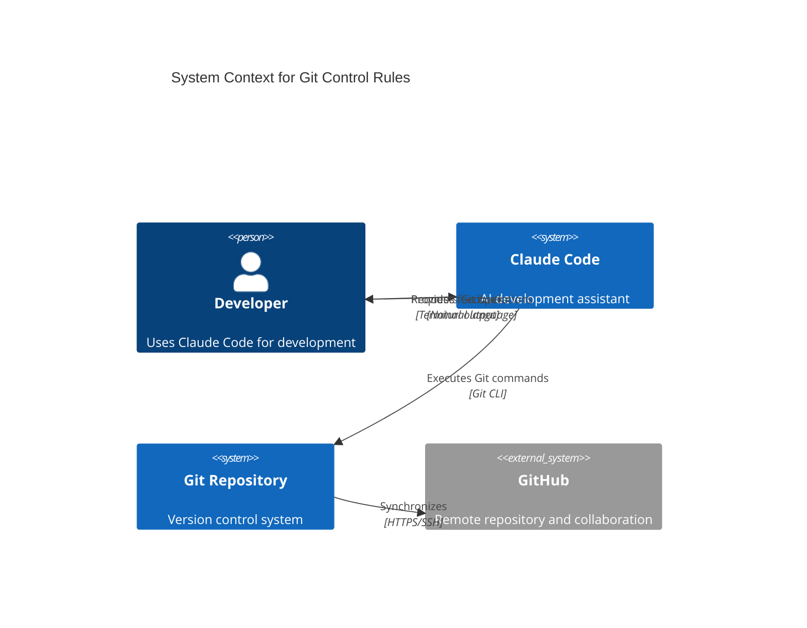
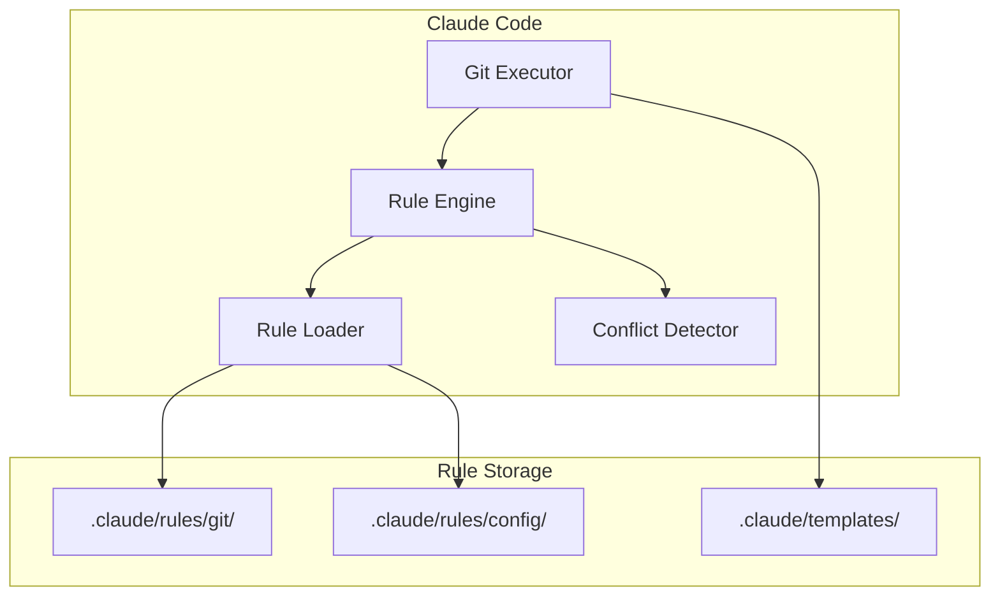

# Git Control Feature Design Document

## Executive Summary
This design document outlines the implementation of Git control rules for Claude Code within the Bootstrap project. The solution provides a modular, secure-by-default rule system that guides Claude Code in performing Git and GitHub operations consistently and safely. The design emphasizes scalability, security, and minimal token overhead while maintaining simplicity for users from novice to expert levels.

## Requirements

### Functional Requirements
- Support basic Git operations: add, commit, push, pull
- Implement Conventional Commits standard for commit messages
- Define a clear branching strategy with feature-version naming
- Ensure GitHub feature parity for all Git operations
- Provide modular rule structure for future expansion
- Create comprehensive documentation for each capability

### Non-Functional Requirements
- **Performance**: Minimal token overhead (~5-10% increase)
- **Security**: Rules must be secure by default with immutable definitions
- **Scalability**: Support unlimited rule additions without clutter
- **Usability**: Clear documentation with links to official references
- **Compatibility**: Full integration with existing CLAUDE.md conventions
- **Legal**: All implementations must be completely legal

## Current State Analysis
The Bootstrap project currently has:
- Basic CLAUDE.md with Python-focused conventions
- No Git-specific behavioral rules
- Clean project structure with organized directories
- Command-based architecture for feature development
- Minimal commit history (single initial commit)

## Proposed Design

### Overview
Implement a structured rule system under `.claude/rules/` with one rule per file, organized by category. Rule definitions are immutable and secure by default, with user preferences stored separately to control which rules are active.

### Architecture

#### System Context


#### Component Structure


### Rule File Structure
```
.claude/
├── rules/
│   ├── README.md                    # Navigation and rule index
│   ├── git/
│   │   ├── index.md                # Git rules overview
│   │   ├── git-add-safety.md       # Safe staging practices
│   │   ├── git-commit-format.md    # Conventional commits
│   │   ├── git-push-validation.md  # Pre-push checks
│   │   ├── git-pull-strategy.md    # Pull and merge approach
│   │   └── git-branch-naming.md    # Branch conventions
│   └── config/
│       ├── user-preferences.yaml   # User overrides
│       └── conflict-log.md         # Conflict tracking
└── templates/
    ├── commit-message.template     # Commit format template
    └── branch-name.template        # Branch naming template
```

### Rule Definition Format
Each rule follows a standardized format:
```markdown
# Rule: [Name]

## ID: [category/filename]
## Status: Active|Experimental|Deprecated
## Security Level: High|Medium|Low
## Token Impact: [Estimated tokens per operation]

## Description
[Clear explanation of what the rule does]

## Rule Definition
```yaml
trigger: [Git command or pattern]
conditions: [When rule applies]
actions: [What to do]
validations: [Checks to perform]
```

## Rationale
[Why this rule exists]

## Examples
[Good and bad examples]

## Related Rules
[Links to related rules]
```

### Design Decisions
1. **One Rule Per File** (ADR-001): Provides clarity and prevents scope confusion
2. **Conventional Commits** (ADR-002): Industry standard for commit messages
3. **Feature Branch Workflow** (ADR-003): Simple branching with version tracking

## Alternative Approaches Considered

### Alternative 1: Inline Git Section in CLAUDE.md
- **Pros**: Simple, single file
- **Cons**: Not scalable, could become unwieldy
- **Rejected because**: Would make CLAUDE.md too large as rules expand

### Alternative 2: Separate GIT_RULES.md File
- **Pros**: Modular, simple to implement
- **Cons**: Root directory clutter with multiple rule files
- **Rejected because**: Doesn't scale well for multiple rule categories

## Implementation Plan

### Phase 1: Core Infrastructure
1. Create `.claude/rules/` directory structure
2. Implement rule loader logic in CLAUDE.md
3. Create initial Git rules for basic operations
4. Add commit message and branch templates

### Phase 2: Rule Implementation
1. git-add-safety.md - Safe file staging
2. git-commit-format.md - Conventional commits
3. git-push-validation.md - Pre-push checks
4. git-pull-strategy.md - Pull strategies
5. git-branch-naming.md - Branch conventions

### Phase 3: Documentation
1. Create comprehensive README.md in rules directory
2. Add navigation index files
3. Link to official Git documentation
4. Create user preference examples

### Phase 4: Testing and Validation
1. Test each rule independently
2. Verify token overhead stays under 10%
3. Ensure conflict detection works
4. Validate security measures

## Risks and Mitigations

### Technical Risks
- **Risk**: Rule conflicts causing confusion
  - **Mitigation**: Conflict detection system with logging
  
- **Risk**: Token overhead exceeding estimates
  - **Mitigation**: Lazy loading and caching strategies

- **Risk**: Complex rules being hard to understand
  - **Mitigation**: One rule per file with clear examples

### Project Risks
- **Risk**: Users disabling important safety rules
  - **Mitigation**: Rules are secure by default; users must explicitly disable rules via preferences

- **Risk**: Future rule categories cluttering structure
  - **Mitigation**: Organized directory hierarchy

## Success Criteria
1. Claude Code correctly implements full range of Git operations
2. Claude Code correctly implements full range of GitHub operations
3. Comprehensive documentation in docs/ folder
4. Token overhead remains under 10%
5. All rules have immutable definitions (users control activation via preferences)
6. All basic Git operations have defined rules

## Next Steps
1. Generate PRP from this design document
2. Implement core infrastructure
3. Create initial rule set
4. Test with real-world scenarios
5. Document in project docs

## Appendices

### A. Conventional Commits Types
- feat: New feature
- fix: Bug fix
- docs: Documentation
- style: Formatting
- refactor: Code restructuring
- test: Testing
- chore: Maintenance

### B. Security Levels
- **High**: Operations that could expose sensitive data
- **Medium**: Operations that could cause data loss
- **Low**: Safe operations with minimal risk

### C. Future Enhancements
See TASK.md for complete list of future features including:
- Conflict resolution rules
- Tag management
- Advanced GitHub features
- CI/CD integration
- Pre-commit hooks