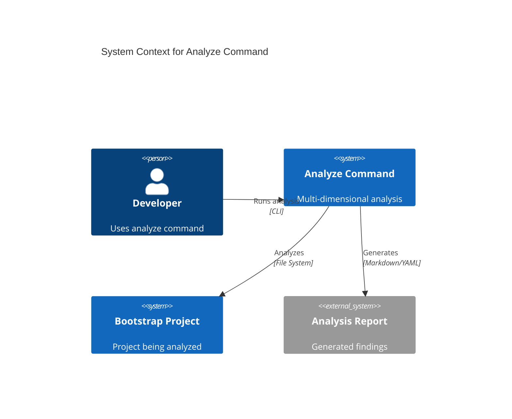
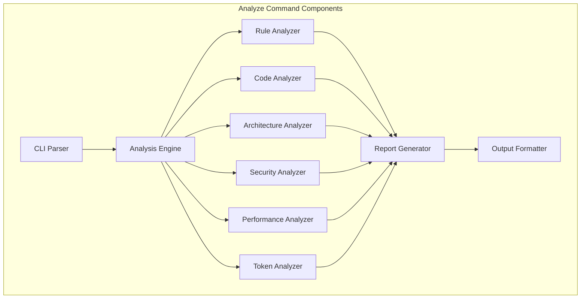

# Analyze Command Design Document

## Executive Summary

The `/analyze` command provides multi-dimensional analysis capabilities specifically designed for Bootstrap's rule-based architecture. It focuses on validating rules, ensuring code quality, analyzing architecture, identifying security issues, and optimizing token usage. This command serves as the primary automated quality assurance tool for Bootstrap projects.

## Requirements

### Functional Requirements
- Analyze rule files for structure and compliance
- Perform code quality checks across the project
- Evaluate system architecture and design patterns
- Identify security vulnerabilities
- Find performance bottlenecks
- Analyze and optimize token usage
- Generate clear, actionable reports

### Non-Functional Requirements
- Complete analysis in <30 seconds for typical projects
- False positive rate <5%
- Integrate seamlessly with Bootstrap conventions
- Provide severity-based reporting (ERROR, WARNING, INFO)
- Support incremental analysis for large codebases

## Current State Analysis

Bootstrap currently has:
- Rule validation through manual review
- Basic token analysis in benchmarks/
- No automated code quality checks
- No systematic security analysis
- Limited architecture visualization

## Proposed Design

### Overview

The analyze command uses a modular architecture where each analysis type is an independent analyzer that can be composed together.

### Architecture

#### System Context


#### Component Architecture


### Analysis Types

#### 1. Rule Analysis (`--rules`)
- Validates YAML syntax in rule files
- Checks rule metadata completeness
- Verifies documentation links
- Ensures ID matches file location
- Validates trigger/action patterns
- Checks for rule conflicts and overlaps
- Validates rule import chains
- Ensures rule categories are properly defined

#### 2. Code Analysis (`--code`)
- Naming conventions (PEP8 for Python)
- Function complexity (McCabe complexity)
- DRY principle violations
- Type safety (type hints coverage)
- Error handling patterns
- Docstring completeness
- Import organization
- Dead code detection

#### 3. Architecture Analysis (`--arch`)
- Component dependencies
- Circular dependencies
- Layer violations
- Pattern consistency
- Module cohesion

#### 4. Security Analysis (`--security`)
- Input validation
- Authentication patterns
- Authorization checks
- Sensitive data handling
- Injection vulnerabilities

#### 5. Performance Analysis (`--perf`)
- Algorithm complexity
- Database query patterns
- Caching opportunities
- Resource usage
- Bottleneck identification

#### 6. Token Analysis (`--tokens`)
- Import chain efficiency
- Rule token overhead
- Documentation size impact
- Optimization opportunities
- Context usage patterns

### Report Format

```yaml
Analysis_Report:
  Summary:
    Total_Issues: 15
    Errors: 3
    Warnings: 8
    Info: 4
    Analysis_Time: "12.3s"
  
  Rule_Analysis:
    Issues:
      - file: ".claude/rules/git/git-add-safety.md"
        severity: ERROR
        message: "Missing security level in metadata"
        line: 8
        suggestion: "Add 'Security Level: High' to metadata"
        auto_fixable: true
      - file: ".claude/rules/git/git-commit-format.md"
        severity: WARNING
        message: "Rule conflicts with git-commit-semantic"
        line: 15
        suggestion: "Clarify precedence or merge rules"
  
  Code_Analysis:
    Issues:
      - file: "src/analyzer.py"
        severity: WARNING
        message: "Function 'analyze_all' has complexity of 15 (threshold: 10)"
        line: 45
        suggestion: "Split into smaller functions"
      - file: "src/utils.py"
        severity: INFO
        message: "Missing type hints for 3 functions"
        line: [12, 28, 34]
        suggestion: "Add type annotations for better code clarity"
  
  Token_Analysis:
    Current_Usage: 2500
    Optimized_Usage: 1800
    Savings: "28%"
    Breakdown:
      rule_imports: 1200
      documentation: 800
      code_context: 500
    Suggestions:
      - "Combine related rules to reduce import overhead"
      - "Move examples to separate documentation"
      - "Use rule categories to reduce individual imports"
```

### Example Terminal Output

```bash
$ /analyze --rules --tokens

🔍 Bootstrap Analyzer v1.0.0
━━━━━━━━━━━━━━━━━━━━━━━━━━━━━━━━━━━━━━━━━━━━━━━━━━━━━

📋 Analyzing Rules...
  ✅ Found 15 rule files
  ⚠️  3 issues detected

📊 Token Analysis...
  Current usage: 2,500 tokens
  Optimized: 1,800 tokens (28% reduction possible)

━━━━━━━━━━━━━━━━━━━━━━━━━━━━━━━━━━━━━━━━━━━━━━━━━━━━━

❌ ERRORS (1)
  .claude/rules/git/git-add-safety.md:8
    Missing required 'security_level' in metadata

⚠️  WARNINGS (2)
  .claude/rules/git/git-merge-strategy.md:15
    Potential conflict with git-pull-strategy rule
    
  Token usage approaching context limit (2,500/3,000)

💡 Run with --fix to auto-fix 1 issue
📄 Full report saved to: .analyze-report.yml
```

### Command Syntax

```bash
# Analyze everything
/analyze

# Specific analysis types
/analyze --rules --tokens
/analyze --code --security
/analyze --arch --perf

# Focused analysis
/analyze --rules .claude/rules/git/
/analyze --code src/

# Different output formats
/analyze --format yaml
/analyze --format markdown
/analyze --format summary
/analyze --format json

# Severity filtering
/analyze --min-severity warning
/analyze --errors-only

# Configuration file
/analyze --config .analyze.yml

# Quiet mode (only show errors)
/analyze --quiet

# Verbose mode (show all details)
/analyze --verbose

# Fix mode (auto-fix safe issues)
/analyze --fix
```

### Configuration File Format

```yaml
# .analyze.yml
analyze:
  # Global settings
  severity_threshold: warning
  output_format: markdown
  
  # Analyzer-specific settings
  rules:
    enabled: true
    strict_mode: false
    ignore_patterns:
      - "*.draft.md"
      - "examples/*"
  
  code:
    enabled: true
    max_complexity: 10
    min_coverage: 80
    languages:
      - python
      - javascript
  
  tokens:
    enabled: true
    max_context: 8000
    warn_threshold: 6000
  
  # Custom severity mappings
  severity_overrides:
    "missing-docstring": info
    "complex-function": error
```

### Analyzer Interface

```python
from abc import ABC, abstractmethod
from typing import List, Dict, Any

class BaseAnalyzer(ABC):
    """Base class for all analyzers."""
    
    @abstractmethod
    def analyze(self, target: str, config: Dict[str, Any]) -> List[Issue]:
        """Run analysis on target with given configuration."""
        pass
    
    @abstractmethod
    def get_name(self) -> str:
        """Return analyzer name."""
        pass
    
    @abstractmethod
    def get_description(self) -> str:
        """Return analyzer description."""
        pass
    
    @abstractmethod
    def supports_auto_fix(self) -> bool:
        """Return whether analyzer supports auto-fixing."""
        pass

class Issue:
    """Represents a single analysis issue."""
    
    def __init__(
        self,
        file: str,
        line: int,
        severity: str,
        message: str,
        suggestion: str = None,
        auto_fixable: bool = False
    ):
        self.file = file
        self.line = line
        self.severity = severity
        self.message = message
        self.suggestion = suggestion
        self.auto_fixable = auto_fixable
```

## Implementation Plan

### Phase 1: Foundation (Week 1)
1. Create command file structure (`commands/analyze.py`)
2. Implement base analysis engine with plugin architecture
3. Define analyzer interface and base classes
4. Create report generation framework

### Phase 2: Core Analyzers (Week 2)
5. Add rule analyzer (most Bootstrap-specific)
   - YAML validation
   - Metadata checking
   - Import chain analysis
6. Add token analyzer (unique to Bootstrap)
   - Context usage tracking
   - Import overhead calculation
   - Optimization suggestions

### Phase 3: Extended Analyzers (Week 3)
7. Add code analyzer
   - Python-specific checks
   - Complexity metrics
   - Style validation
8. Add architecture analyzer
   - Dependency mapping
   - Module structure validation

### Phase 4: Advanced Features (Week 4)
9. Add security and performance analyzers
10. Implement output formatters (YAML, Markdown, JSON)
11. Add configuration file support
12. Create comprehensive tests

### Phase 5: Polish (Week 5)
13. Document usage patterns
14. Add examples to documentation
15. Performance optimization
16. Integration with CI/CD

## Risks and Mitigations

### Technical Risks
- **Complexity**: Mitigate with modular design
- **Performance**: Use caching and incremental analysis
- **False positives**: Provide configuration to tune sensitivity

### Project Risks
- **Scope creep**: Start with core analyzers, add others later
- **Integration complexity**: Follow existing Bootstrap patterns

## Success Criteria

- All rule files can be validated automatically
- Token usage analysis matches manual calculations
- Code quality issues are identified accurately
- Reports provide actionable suggestions
- Analysis completes quickly (<30s)
- Integration with existing workflow is seamless
- Auto-fix capability for safe issues
- Configuration flexibility for different project needs

## Specific Bootstrap Rule Checks

### Rule File Validation
1. **Metadata Completeness**
   - ID field matches file path
   - Description is present and clear
   - Category is valid
   - Security level is defined (when applicable)
   - Token impact is documented

2. **Content Structure**
   - Proper markdown formatting
   - No broken internal links
   - Examples are valid and tested
   - Trigger patterns are properly escaped
   - Actions are implementable

3. **Import Chain Analysis**
   - No circular dependencies
   - Import depth is reasonable
   - Total token count for chain
   - Redundant imports detected

4. **Conflict Detection**
   - Overlapping trigger patterns
   - Contradictory actions
   - Priority conflicts
   - Category mismatches

## Integration with Bootstrap Features

### Rule System Integration
- Analyze command respects MASTER_IMPORTS.md
- Validates rules referenced in CLAUDE.md
- Checks rule categories against defined structure
- Ensures rule documentation standards

### Memory System Integration
- Validates @import statements in CLAUDE.md
- Checks memory rule formatting
- Analyzes token overhead of memory imports
- Suggests memory optimization strategies

### Git Control Integration
- Validates git control rules syntax
- Checks for conflicting git rules
- Ensures git workflow consistency
- Analyzes commit message patterns

### Task Management Integration
- Can analyze TASK.md for patterns
- Suggests task organization improvements
- Identifies duplicate or conflicting tasks
- Validates task date formats

## Next Steps

1. Create `/analyze` command file
2. Implement rule analyzer first (highest value)
3. Add token analyzer (unique to Bootstrap)
4. Progressively add other analyzers
5. Create comprehensive tests
6. Document usage patterns
7. Add analyze command to CLAUDE.md rules
8. Create analyze command validation rule