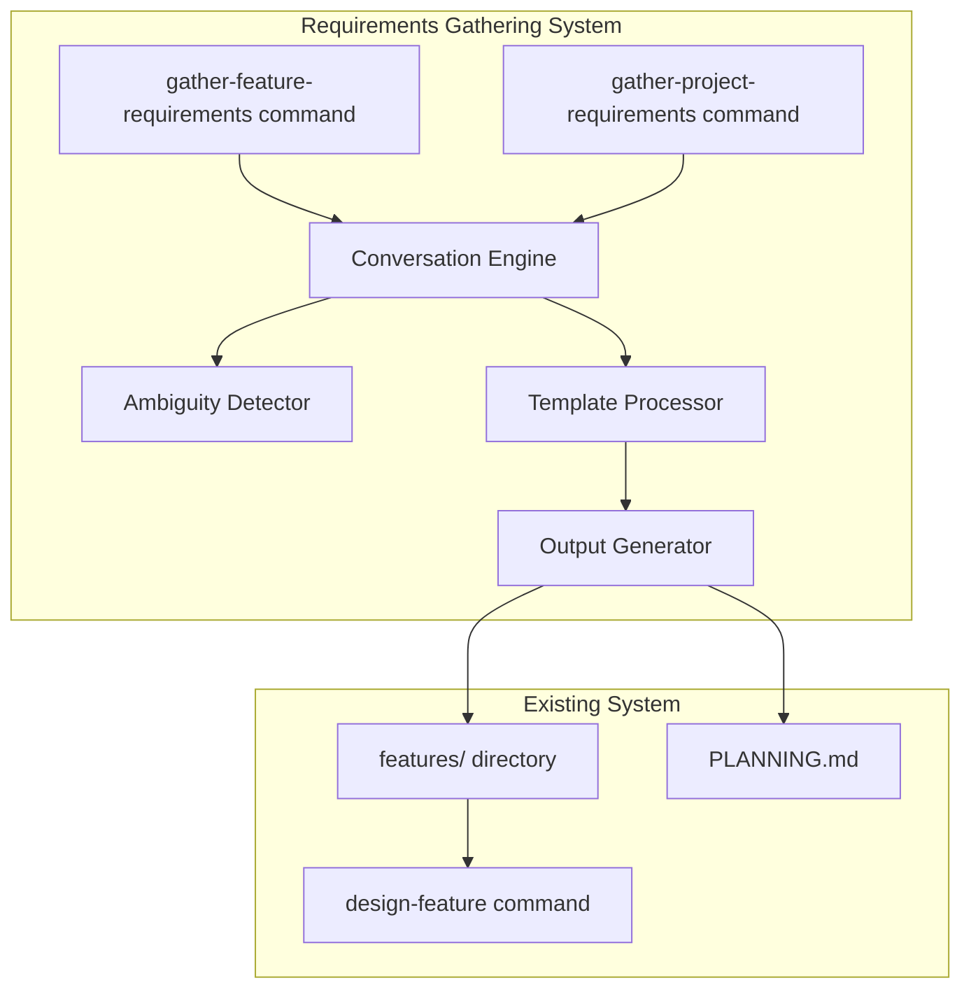
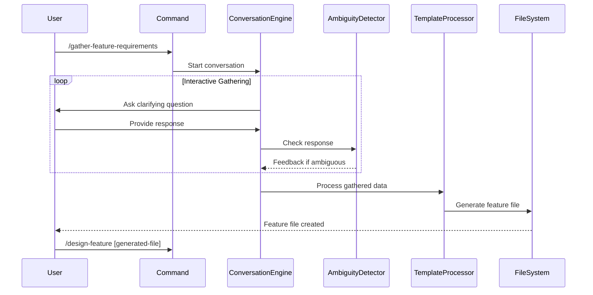

# Requirements Gathering System Design Document

## Executive Summary

This design document outlines a phased implementation of an interactive requirements gathering system for the Bootstrap framework. The system will provide two primary commands: `/gather-feature-requirements` for detailed feature specifications and `/gather-project-requirements` for project-level planning. The implementation follows an incremental 5-week delivery schedule, starting with minimal viable functionality and progressively adding sophistication.

## Requirements

### Functional Requirements

Based on the feature specification and clarifications:

1. **Interactive Requirements Elicitation**
   - Conversational flow using prompts to guide users
   - Support for both direct specification and problem-solution discovery
   - Progressive refinement through clarifying questions
   - Real-time ambiguity detection and feedback

2. **Output Generation**
   - Feature files compatible with `/design-feature` command
   - PLANNING.md generation and updates
   - Metadata tracking for basic traceability
   - Template-based consistent formatting

3. **Integration Points**
   - Seamless workflow with existing design-feature command
   - Feature files as direct input to design process
   - PLANNING.md updates for evolving project scope
   - Bootstrap framework conventions compliance

4. **Quality Assurance**
   - Automatic ambiguity detection in responses
   - INVEST criteria validation for user stories
   - Completeness checking with suggestions
   - Reference-backed best practices

### Non-Functional Requirements

1. **Usability**
   - Simple conversational interface
   - Clear prompts and guidance
   - Immediate value in Week 1
   - No complex setup required

2. **Performance**
   - Quick generation of initial features
   - Incremental improvements without breaking changes
   - Token-efficient markdown output

3. **Maintainability**
   - Follows Bootstrap command template
   - Modular design for phased delivery
   - Clear separation between weeks' functionality

## Current State Analysis

### Existing Patterns
- Command structure in `.claude/commands/` with consistent template
- Feature files in `features/` directory with established format
- Design-to-PRP workflow already established
- Task management system for tracking implementation

### Integration Opportunities
- Leverage existing command template for consistency
- Use established feature file format as output target
- Connect to design-feature as next step in workflow
- Potential future integration with task management

## Proposed Design

### Overview

The system consists of two main commands implemented across 5 weeks:

1. **Week 1-2**: `/gather-feature-requirements` - Basic then enhanced feature gathering
2. **Week 3-4**: `/gather-project-requirements [file]` - Project scope definition and integration (optional file argument for updates or external docs)
3. **Week 5**: Quality validation and refinement across both commands

### Architecture

#### Component Structure

#### Data Flow

### Implementation Phases

#### Week 1: Basic Feature Requirements
- Optional initial context via argument
- Minimal conversation flow (role, feature, benefit, criteria)
- Simple template output
- Basic user story format
- Context extraction from provided input
- No validation beyond structure

#### Week 2: Enhanced Feature Requirements  
- Multiple stakeholder perspectives
- Boundary questions
- Dependency detection
- Pattern-based ambiguity detection with suggestions (per ADR-003)
- INVEST criteria checking

#### Week 3: Basic Project Requirements
- Core questions (What, Who, Why)
- Simple PLANNING.md generation
- 5 essential sections
- Support for updates to existing PLANNING.md (via file argument)
- Support for external document input (reports, specs)

#### Week 4: Integration
- Link features to project goals
- Bidirectional references
- Context awareness between commands

#### Week 5: Quality Gates
- Completeness validation
- Review triggers
- Issue summaries
- Best practice references

## Alternative Approaches Considered

### Alternative 1: Template-First Approach
**Description**: Provide templates that users fill in manually with minimal interaction

**Pros**:
- Simpler implementation
- Faster initial delivery
- Lower complexity

**Cons**:
- Less value over existing templates
- No intelligent guidance
- Higher user effort

**Decision**: Rejected - doesn't provide sufficient value over current state

### Alternative 2: Full NLP Analysis
**Description**: Natural language processing to extract requirements from freeform text

**Pros**:
- More flexible input
- Potentially faster for users
- Advanced capability

**Cons**:
- Complex implementation
- Higher error rate
- Difficult to validate
- May require external dependencies

**Decision**: Rejected - too complex for incremental approach

### Alternative 3: Hybrid Interactive (Chosen)
**Description**: Guided conversation with structured prompts and validation (as per ADR-001)

**Pros**:
- Clear value proposition
- Incremental complexity
- Predictable results
- Builds on existing patterns
- No external dependencies

**Cons**:
- Requires careful prompt design
- May feel restrictive to some users
- May require multiple rounds for complete information

**Decision**: Selected - best balance of value and implementation feasibility, follows ADR-001

## Implementation Plan

### Week 1 Tasks
1. Create `/gather-feature-requirements` command file with optional argument support
2. Implement basic conversation flow with context extraction
3. Add user story template processing
4. Generate feature file output
5. Test with Bootstrap's own requirements (both with and without initial context)

### Week 2 Tasks
1. Add stakeholder perspective gathering
2. Implement ambiguity detection
3. Add INVEST criteria validation
4. Enhance conversation branching
5. Improve output quality

### Week 3 Tasks
1. Create `/gather-project-requirements` command with optional file argument
2. Implement project-level questions
3. Create PLANNING.md template
4. Add update capability for existing files (when passed as argument)
5. Add external document parsing (when non-PLANNING.md file passed)
6. Test with Bootstrap project update using existing PLANNING.md

### Week 4 Tasks
1. Add cross-reference capability
2. Implement context awareness
3. Link features to project goals
4. Add traceability metadata
5. Test integrated workflow

### Week 5 Tasks
1. Add completeness validation
2. Implement review triggers
3. Add quality scoring
4. Create issue summaries
5. Final testing and refinement

## Risks and Mitigations

### Technical Risks

1. **Conversation Complexity**
   - Risk: Branching logic becomes unwieldy
   - Mitigation: Start linear, add branches incrementally
   - Monitoring: Track conversation completion rates

2. **Ambiguity Detection Accuracy**
   - Risk: Too many false positives frustrate users
   - Mitigation: Conservative detection, user can override
   - Monitoring: Track acceptance of suggestions

3. **Template Rigidity**
   - Risk: Output too constrained for some projects
   - Mitigation: Allow template customization in future phase
   - Monitoring: Gather feedback on template suitability

### Project Risks

1. **Scope Creep**
   - Risk: Features become too complex for timeline
   - Mitigation: Strict weekly boundaries, defer to Phase 2 (per ADR-002)
   - Monitoring: Weekly checkpoint reviews

2. **Integration Challenges**
   - Risk: Doesn't integrate smoothly with design-feature
   - Mitigation: Test integration early and often
   - Monitoring: End-to-end workflow testing

3. **Incremental Delivery Risks**
   - Risk: Refactoring needed in later weeks
   - Mitigation: Accept temporary limitations (per ADR-002)
   - Monitoring: Track technical debt for Phase 2

## Success Criteria

### Week 1
- Generate first feature request for Week 2 development
- Feature file works with design-feature command
- Basic conversation completes without errors

### Week 2
- Ambiguity detection provides useful feedback
- INVEST validation catches common issues
- Multiple perspectives captured effectively

### Week 3
- PLANNING.md generated for Bootstrap project
- Existing PLANNING.md successfully updated
- All essential sections populated

### Week 4
- Features reference project goals
- Bidirectional navigation functional
- Context maintained between commands

### Week 5
- 90% of requirements pass completeness check
- Review suggestions identify real issues
- Full workflow from requirements to design operational

## Appendices

### A. Command Template Structure
Both commands will follow the established Bootstrap command template found in `.claude/templates/command.template.md`

### B. Feature File Format
Output will match existing feature file format as seen in `features/` directory

### C. Reference Resources
- User Stories Applied (Mike Cohn)
- EARS Requirements Syntax
- INVEST Criteria
- Volere Requirements Template

## Next Steps

1. Create ADRs for key architectural decisions
2. Generate PRP from this design document
3. Begin Week 1 implementation
4. Use generated features for self-testing