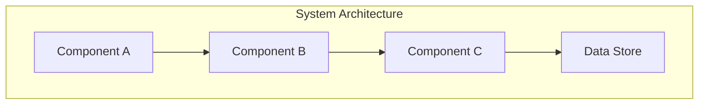

# {System Title} Design Document

## Executive Summary

{Brief overview of the system-level change or infrastructure being designed. 2-3 sentences.}

## System Requirements

### Business Requirements
- {Business need 1}
- {Business need 2}

### Technical Requirements
- **Performance**: {Throughput, latency requirements}
- **Scalability**: {Growth projections, scaling strategy}
- **Reliability**: {Uptime requirements, fault tolerance}
- **Security**: {Security requirements, compliance needs}

### Constraints
- {Technical constraint}
- {Resource constraint}
- {Time constraint}

## System Architecture

### Overview
{High-level description of the system architecture}

### Components

<!-- For complex or multiple diagrams, create a diagrams/ folder in your design directory -->
<!-- Example: [Detailed Architecture](diagrams/detailed-architecture.mmd) -->
<!-- Remember: diagrams/ folder must be inside this design's folder, not at designs root -->

### Component Details

#### {Component Name}
- **Purpose**: {What it does}
- **Technology**: {Tech stack}
- **Interfaces**: {APIs, protocols}
- **Dependencies**: {What it needs}

### Data Architecture
- **Storage**: {Database/file system choices}
- **Data Flow**: {How data moves through system}
- **Data Model**: {Schema/structure}

### Infrastructure
- **Deployment**: {How/where it runs}
- **Monitoring**: {Observability approach}
- **Backup/Recovery**: {DR strategy}

## Implementation Strategy

### Phases
1. **Phase 1**: {What gets built first}
2. **Phase 2**: {What comes next}
3. **Phase 3**: {Final phase}

### Migration Plan
{How to move from current to new system}

## Operations

### Deployment
{Deployment process and requirements}

### Monitoring & Alerts
- {Key metrics to monitor}
- {Alert thresholds}

### Maintenance
{Ongoing maintenance needs}

## Success Criteria
- [ ] {System-level success metric}
- [ ] {Performance target met}
- [ ] {Reliability target met}
- [ ] {All components integrated}

## Risks and Mitigations

| Risk | Impact | Likelihood | Mitigation |
|------|--------|------------|------------|
| {Risk} | {High/Med/Low} | {High/Med/Low} | {Strategy} |

## References
- {Architecture patterns}
- {Technology documentation}
- {Related systems}